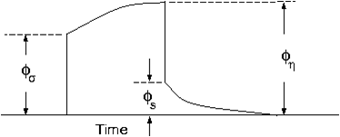

.. _backgroundtheory:

Background theory
=================

Introduction
------------

This section presents theoretical background, numerical examples, and
explanation for implementing the program library . This suite of
algorithms, developed at the UBC-Geophysical Inversion Facility, is
needed to invert DC potentials and IP responses over a 2-D earth
structure. The manual is designed so that a geophysicist who has an
understanding of DC resistivity and Induced Polarization field
experiments, but who is not necessarily versed in the details of inverse
theory, can use the codes and invert his or her data.

A typical DC/IP experiment involves inputting a current ***I*** to the
ground and measuring the potential away from the source. In a
time-domain system the current has a duty cycle which alternates the
direction of the current and has off-times between the current pulses at
which the IP voltages are measured. A typical time-domain signature is
shown in Figure :numref:`basicTime`. In this Figure, :math:`\phi_\sigma` is
the potential that is measured in the absence of chargeability effects.
This is the “instantaneous” value of the potential measured when the
current is turned on. In mathematical terms this potential is related to
the electrical conductivity, :math:`\sigma`, by:

.. math::
   \phi_\sigma = \mathcal{F}_{dc}[\sigma] \\
   :label: genFwd

where the forward mapping operator :math:`\mathcal{F}_{dc}` is defined
by the equation

.. math::
   \nabla \cdot (\sigma\nabla\phi_\sigma) = - \mathbf{I}\delta(r-r_s) \\
   :label: dcForward

and also by appropriate boundary conditions. In equation
:eq:`dcForward`, :math:`\sigma` is the electrical conductivity in
Siemens/meter (S/m), :math:`\nabla` is the gradient operator,
:math:`\mathbf{I}` is the strength of the input current in Amperes, and
:math:`r_s` is the location of the current source. For typical earth
structures, :math:`\sigma`, while positive, can vary over many orders of
magnitude. The potential :math:`\phi_\sigma` in equation :eq:`dcForward`
is the potential due to a single current. This is the value that would
be measured in a pole-pole experiment. If potentials from pole-dipole or
dipole-dipole surveys are to be generated then they can be obtained by
using equation :eq:`dcForward` and the principle of superposition.

When the earth material is chargeable the measured voltage will change
with time and reach a limit value which is denoted by :math:`\phi_\eta`
in Figure :numref:`basicTime`. There are a multitude of microscopic
polarization phenomena, which collaborate so that this final value is
achieved but all of these effects can be consolidated into a single
macroscopic parameter called “chargeability”. We denote chargeability by
the symbol :math:`\eta`. Chargeability is dimensionless, positive, and
confined to the region [0,1).

   Definition of the three potentials associated with DC/IP experiments.

To carry out forward modelling to compute :math:`\phi_\eta` we adopt the
formulation of :ref:`Siegel59`, which says that the effect
of a chargeable ground is modelled by using the dc resistivity forward
mapping, :math:`\mathcal{F}_{dc}`, but with the conductivity replaced by
:math:`\sigma = \sigma(1-\eta)`. Thus:

.. math::
   \phi_\eta = \mathcal{F}_{dc}[\sigma(1-\eta)]
   :label: phiEta

or

.. math::
   \nabla \cdot (\sigma(1-\eta)\nabla\phi_\sigma) = - \mathbf{I}\delta(r-r_s)
   :label: ipForward

The IP datum, which we refer to as “apparent chargeability” is defined
by

.. math::
   \eta_a = \frac{\phi_s}{\phi_\eta} = \frac{\phi_\eta - \phi_\sigma}{\phi_\eta}
   :label: genApCharge

or

.. math::
   \eta_a = \frac{\mathcal{F}_{dc}[\sigma(1-\eta)]-\mathcal{F}_{dc}[\sigma]}{\mathcal{F}_{dc}[\sigma(1-\eta)]}
   :label: genApChargeDC

Equation :eq:`genApChargeDC` shows that the apparent chargeability can
be computed by carrying out two DC resistivity forward modelling
routines with conductivities :math:`\sigma` and :math:`\sigma(1-\eta)`.
Note that in this definition apparent chargeability is dimensionless
and, in the case of data acquired over an earth having constant
chargeability :math:`\eta_o`, we have :math:`\eta_a = \eta_o`.

The field data from a DC/IP survey are a set of :math:`N` potentials
(ideally :math:`\phi_\sigma`, but usually :math:`\phi_\eta`) and a set
of :math:`N` secondary potentials :math:`\phi_s` or a quantity that is
related to :math:`\phi_s`. The goal of the user is to utilize these data
to acquire quantitative information about the distribution of the two
physical parameters of interest: conductivity :math:`\sigma(x,y,z)` and
chargeability :math:`\eta(x,y,z)`.

The distribution of conductivity and chargeability in the earth can be
extremely complicated. Assuredly earth structure is 3D, but for the
DC/IP codes developed here we restrict ourselves to 2D structures and
assume that the survey has been carried out along a traverse that is
perpendicular to strike. The cross-section of the earth is divided into
rectangular prisms each having a constant value of conductivity and
chargeability.

Forward modelling
-----------------

The forward modelling for the DC potentials and IP apparent
chargeabilities and secondary potentials is accomplished using a finite
difference technique to solve equation :eq:`dcForward`. The program which
performs this calculation is . In Version  we include the option to
calculate IP data by multiplying the sensitivity matrix
:math:`\mathbf{J}` by the chargeability provided by user. That is, we
forward model with the linear equations that will be used for the
inversion. The chargeability in this case can have arbitrary units. The
forward modelled data are calculated as

.. math:: 
   \boldsymbol{\vec{d}_{ip}} = \boldsymbol{\vec{J}_{ip}}\eta,

where :math:`\boldsymbol{\vec{d}_{ip}}` is the IP data and :math:`\boldsymbol{\vec{J}_{ip}}` is
the sensitivity matrix for the IP problem:

.. math::
   \boldsymbol{\vec{J}_{ip}} = -\frac{\partial \ln\phi_\eta}{\partial \ln\sigma} = -\frac{1}{\sigma_\eta}\frac{\partial\phi_\eta}{\partial \ln\sigma} = -\frac{1}{\boldsymbol{\vec{d}_{dc}}}\boldsymbol{\vec{J}_{dc}}
   :label: sensIP

given DC data, :math:`\boldsymbol{\vec{d}_{dc}}`. Forward modeling using equation
:eq:`sensIP` is further explained in the section :ref:`Inversion of IP data<invIPdata>`.

General inversion methodology
-----------------------------

The computing programs outlined in this manual solve two inverse
problems. In the first we invert the DC potentials :math:`\phi_\sigma`
to recover the electrical conductivity :math:`\sigma(x,z)`. This is a
non-linear inverse problem that requires linearization of the data
equations and subsequent iteration steps. Next, we invert IP data to
recover the chargeability :math:`\eta(x,z)`. Because chargeabilities are
usually small quantities :math:`(\eta < 0.3)` it is possible to
linearize equation :eq:`genApChargeDC and derive a linear system of
equations to be solved. Irrespective of which data set is being inverted
however, we basically use the same methodology to carry out the
inversions.

To outline our methodology it is convenient to introduce a single
notation for the and for the . We let
:math:`\boldsymbol{\vec{d}} = (d_1,d_2,\ldots,d_n)^T` denote the data so that
:math:`d_i` is the i\ :math:`^{th}` potential in a DC resistivity data
set or the i\ :math:`^{th}` apparent chargeability in an IP survey. Let
the physical property of interest be denoted by the symbol :math:`m`.
The quantity :math:`m_j` can denote the conductivity or chargeability
for the j\ :math:`^{th}` cell. For the inversion we choose
:math:`m_j = \ln(\sigma_j)`, when inverting for conductivities and
:math:`m_j = \eta_j` when reconstructing the chargeability section.

The goal of the inversion is to recover a model vector
:math:`\boldsymbol{\vec{m}} = (m_1,m_2,\ldots,m_m)^T`, which acceptably reproduces
the :math:`n` observations
:math:`\boldsymbol{\vec{d}^{obs}} = (d_1^{obs},d_2^{obs},...,d_n^{obs})^T`.
Importantly, the data are noise contaminated, therefore we don’t want to
fit them precisely. A perfect fit in our case would be indicative, that
incorrect earth model is recovered, as some features observed in the
constructed model would assuredly be artifacts of the noise.

Alternatively, if we fit the data too poorly then information about the
conductivity that is coded in the data will not have been recovered. Our
objective therefore is to neither under-fit nor over-fit the data.
Rather, we want to find a model that reproduces the data only to within
an amount that is justified by the estimated uncertainty in the data. To
accomplish this we introduce a global misfit criterion:

.. math::
   \psi_d = \left\| \mathbf{W}_d(\mathbf{G}\mathbf{m}-\mathbf{d})\right\|^2
   :label: phid

where :math:`\boldsymbol{\vec{W}_d}` is a data weighting matrix. In this work, we
shall assume that the noise contaminating the i\ :math:`^{th}`
observation is an uncorrelated Gaussian random variable having zero mean
and standard deviation :math:`\epsilon_i`. As such, an appropriate form
for the :math:`N \times N` matrix is
:math:`\boldsymbol{\vec{W}_d} = diag\left\{1/\epsilon_1,\ldots,1/\epsilon_n\right\}`.
With this choice, :math:`\psi_d` is the random variable distributed as
chi-squared with :math:`N` degrees of freedom. Its expected value is
approximately equal to :math:`N` and accordingly, :math:`\psi_d^*`, the
target misfit for the inversion, should be approximately equal to this
value.

It is common to use an :math:`l_2` norm measure of data fit as shown in
equation :eq:`phid`. However, the Huber norm
:ref:`Huber64` has been incorporated to handle outliers
in the data. The general form of the Huber norm is

.. math::
   \tau(y) = \begin{cases}
   y^2 & |y| \leq c \\
   2c|y| - c^2 & |y| > c.
   \end{cases}
   :label: Huber

From equation :eq:`Huber`, let
:math:`y=\textbf{W}_d(\textbf{G}\mathbf{m}-\textbf{d})` and the data
misfit function then becomes

.. math::
   \Phi_d = \sum_{i=1}^n \begin{cases}
   \left[ {\textbf{W}_d}^i(\textbf{G}_i\mathbf{m}-{d_i}) \right] ^2 & |y_i| \leq c \\
   2c|{\textbf{W}_d}^i(\textbf{G}_i\mathbf{m}-{d_i})|-c^2 & |y_i| > c.
   \end{cases}
   :label: Huber_phid

where :math:`c` is a constant that separates the elements of vector
:math:`y` into those considered large and those that are considered
small :ref:`FarquharsonOldenburg98`.

Earth conductivity distributions are complex. To allow maximum
flexibility to produce a model of arbitrary shape it is important that
:math:`M`, the number of cells representing the model, is large. In our
inversions, :math:`M` will almost always be greater than :math:`N`, the
number of data. The inverse problem therefore reduces to finding a set
of :math:`M` model parameters using only :math:`N` data constraints
under the condition that :math:`M > N`. Clearly the solution is no
unique and this non-uniqueness represents the principle obstacle for
obtaining unambiguous information about earth structure from the
observations.

Any inversion algorithm (if it works) will produce a model, which
reproduces the data. But there are infinitely many possible models. So
which one does the algorithm produce? It is not good practice to let the
program make a random selection. Rather, a responsible approach is to
direct the inversion algorithm to produce a model that is geologically
reasonable and is constrained by additional information if such
information is available. This can be implemented by formulating a
“model objective function” which, when minimized, produces a model with
desirable characteristics. The critical aspect of the inversion is
therefore to form the model objective function which we characterize by
:math:`\psi_m`. To do this, the user must ask the question “what type of
model is desired?” Should the model be smooth or should it be blocky? Is
there a reference or background model that the constructed model should
emulate? If there is a reference model, is it better known in some
places than others so that the constructed model should be close to the
reference model in certain locations but can depart from our
preconceived ideas in other areas? Whatever the answer to these
questions, a guiding philosophy should always be to find a model which
(in some sense) is “as simple as possible.” The non-uniqueness inherent
in the inversion generally means that we can generate models which are
arbitrarily complicated. We cannot however, make models that are
arbitrarily simple. For example, a half space will generally not
reproduce data acquired from a geophysical survey.

In the inversion algorithms in , our choice for the objective function
:math:`\psi_m` is guided by a desire to find a model which has minimum
structure in the vertical and horizontal directions and at the same time
is close to a reference model :math:`m_o`. To accomplish this, we
minimize a discretized approximation to

.. math::
   \begin{aligned}
   \psi_m(m,m_o) = &\alpha_s \int\int w_s(x,z)(m-m_o)^2 dxdz + \nonumber \\
   &\int \int \left\{ \alpha_x w_x(x,z) \left( \frac{\partial(m-m_o)}{\partial x} \right)^2 + \alpha_z w_z(x,z)\left( \frac{\partial(m-m_o)}{\partial z} \right)^2 \right\} dxdz
   \end{aligned}
   :label: intMOF

In equation :eq:intMOF`, the functions :math:`w_s,w_x,w_z` are
specified by the user and the constant :math:`\alpha_s` controls the
importance of closeness of the constructed model to the reference model
:math:`m_o` and :math:`\alpha_x,\alpha_z` controls the smoothness of the
model in the two directions. Varying the ratio :math:`\alpha_x/\alpha_z`
allows the construction of models that are smoother, thus more
elongated, in either :math:`x-` or :math:`z-`\ direction. The discrete
form of :eq:`intMOF` is the following:

.. math::
   \psi_m &&= (\boldsymbol{\vec{m}}-\boldsymbol{\vec{m}}_o)^T\left\{ \alpha_s \mathbf{W}_s^T\mathbf{W}_s+\alpha_x \mathbf{W}_x^T\mathbf{W}_x+\alpha_z \mathbf{W}_z^T\mathbf{W}_z \right\} (\boldsymbol{\vec{m}}-\boldsymbol{\vec{m}}_o), \nonumber \\
   &&\equiv (\boldsymbol{\vec{m}}-\boldsymbol{\vec{m}}_o)^T\mathbf{W}_m^T\mathbf{W}_m(\boldsymbol{\vec{m}}-\boldsymbol{\vec{m}}_o)^T \\
   :label: shortMOF

.. math::
   \psi_m = ||\mathbf{W}_m(\boldsymbol{\vec{m}}-\boldsymbol{\vec{m}}_o)||^2.
   :label: disMOF

If :math:`w_s, w_x,` and :math:`w_z` are set equal to unity, then
:math:`\boldsymbol{\vec{W}}_s` is a diagonal matrix with elements
:math:`\sqrt{\Delta x \Delta z}`, where :math:`\Delta x` is the length
of the cell and :math:`\Delta z` is its thickness, :math:`\boldsymbol{\vec{W}}_x`
has elements :math:`\sqrt{\Delta z / dx}` where :math:`dx` is the
distance between the centres of horizontally adjacent cells, and
:math:`\boldsymbol{\vec{W}}_z` has elements :math:`\sqrt{\Delta x / dz}` where
:math:`dz` is the distance between the centres of vertically adjacent
cells.

For blockier models, we have incorporated the measure proposed by Ekblom
(:ref:`Ekblom73,Ekblom87`) that has been found to be
useful. The generalized version is given as

.. math::
   \tau(y) = (y^2 + \epsilon^2)^{\frac{\rho}{2}}   
   :label: Ekblom

where :math:`\epsilon` is some positive number. The smaller
:math:`\epsilon` becomes, the measure tends towards the :math:`l_\rho`
norm. Large values of :math:`\epsilon` tend the measure to behave like a
scaled sum-of-squares. For the model objective function in equation
:eq:`shortMOF`, :math:`y = \boldsymbol{\vec{W}}_m(\boldsymbol{\vec{m}} - \boldsymbol{\vec{m}}_o)` and the
system of equations is solved with the projected gradients through a
chi-factor regularization. The resulting model objective function is

.. math::
   \psi_m &&= \left[(\boldsymbol{\vec{m}} - \boldsymbol{\vec{m}}_o)^T\alpha_s\boldsymbol{\vec{W}}^T_s\boldsymbol{\vec{W}}_s(\boldsymbol{\vec{m}} - \boldsymbol{\vec{m}}_o) + \epsilon^2\right]^{\frac{\rho}{2}} + \left[(\boldsymbol{\vec{m}} - \boldsymbol{\vec{m}}_o)^T\alpha_x\boldsymbol{\vec{W}}^T_x\boldsymbol{\vec{W}}_x(\boldsymbol{\vec{m}} - \boldsymbol{\vec{m}}_o) + \epsilon^2 \right]^{\frac{\rho}{2}} \nonumber \\
   &&+ \left[(\boldsymbol{\vec{m}} - \boldsymbol{\vec{m}}_o)^T\alpha_z\boldsymbol{\vec{W}}^T_z\boldsymbol{\vec{W}}_z(\boldsymbol{\vec{m}} - \boldsymbol{\vec{m}}_o) + \epsilon^2 \right]^{\frac{\rho}{2}}\\
   :label: ekblom

Details of the Eklom norm within the context of geophysical inversion
can be found in :ref:`FarquharsonOldenburg98`.

It should be noted that in equation :eq:`disMOF`, the reference model can
be removed from the spatial (:math:`x` and :math:`z`) components. The
effect is that the reference model places emphasis on the magnitude of
the model, but its spatial variations do not influence the spatial
derivatives. The model objective function becomes

.. math::
   \psi_m = (\boldsymbol{\vec{m}}-\boldsymbol{\vec{m}}_o)^T\left(\alpha_s \mathbf{W}_s^T\mathbf{W}_s\right)(\boldsymbol{\vec{m}}-\boldsymbol{\vec{m}}_o) + \boldsymbol{\vec{m}}^T\left\{\alpha_x \mathbf{W}_x^T\mathbf{W}_x+\alpha_z \mathbf{W}_z^T\mathbf{W}_z \right\}\boldsymbol{\vec{m}}
   :label: mofNOref

and for the Ekblom norm

.. math::

   \begin{aligned}
   \psi_m &&= \left[(\boldsymbol{\vec{m}} - \boldsymbol{\vec{m}}_o)^T(\alpha_s\boldsymbol{\vec{W}}^T_s\boldsymbol{\vec{W}}_s)(\boldsymbol{\vec{m}} - \boldsymbol{\vec{m}}_o) + \epsilon^2 \right]^{\frac{\rho}{2}} \nonumber \\
   &&+ \left[\boldsymbol{\vec{m}}^T(\alpha_x\boldsymbol{\vec{W}}^T_x\boldsymbol{\vec{W}}_x)\boldsymbol{\vec{m}} + \epsilon^2 \right]^{\frac{\rho}{2}} + \left[\boldsymbol{\vec{m}}^T(\alpha_z\boldsymbol{\vec{W}}^T_z\boldsymbol{\vec{W}}_z)\boldsymbol{\vec{m}} + \epsilon^2 \right]^{\frac{\rho}{2}}.
   \end{aligned}

This is a new feature in and gives the user greater flexibility. The
inverse problem is now properly formulated as an optimization problem:

.. math::
   & \mbox{minimize } \psi_m(\boldsymbol{\vec{m}},\boldsymbol{\vec{m}}_o)&=||\mathbf{W}_m(\boldsymbol{\vec{m}}-\boldsymbol{\vec{m}}_o)||^2 \\ \nonumber
   & \mbox{subject to } \psi_d(\boldsymbol{\vec{d}},\boldsymbol{\vec{d}}^{obs})&=||\mathbf{W}_d(\boldsymbol{\vec{d}}-\boldsymbol{\vec{d}}^{obs})||^2 =\psi_d^*
   :label: inverseProblem

In equation :eq:`inverseProblem`, :math:`\boldsymbol{\vec{m}}_o` is a starting model
and :math:`\boldsymbol{\vec{W}}_m` is a general weighting matrix which is designed
so that a model with specific characteristics is produced. The
minimization of :math:`\psi_m` yields a model that is close to
:math:`\boldsymbol{\vec{m}}_o` with the metric defined by :math:`\boldsymbol{\vec{W}}_m` and so
the characteristics of the recovered model are directly controlled by
these two quantities. If the data errors are Gaussian and their standard
deviations have been adequately estimated then the target misfit should
be :math:`\psi_d^* = N`. The data misfit function can take the form of
the :math:`l_2` norm as shown above or the Huber norm from equation
:eq:`Huber\_phid`

Inversion of DC data
--------------------

The inversion of the apparent resistivity data is carried out using the
program . The inversion of DC resistivity data formulated as the
minimization in equation :eq:`inverseProblem` is nonlinear since the data
do not depend linearly upon the conductivity model. We tackle this
problem using a Gauss-Newton approach in which the objective function is
linearized about a current model, :math:`m(n)`, and a model perturbation
is solved for and used to update the current model. Substituting
:math:`m(n+1) = m(n)+m` into the objective function in equation
:eq:`inverseProblem`

.. math:: \psi(\boldsymbol{\vec{m}} + \delta \boldsymbol{\vec{m}}) =  \left\| \mathbf{W}_d\left( \mathcal{F}_{dc}[\boldsymbol{\vec{m}}^{(n)}] + \boldsymbol{\vec{J}}\delta\boldsymbol{\vec{m}} - \mathbf{d}\right)\right\|^2 + \beta \left\| \boldsymbol{\vec{W}}_m\left(\boldsymbol{\vec{m}} + \delta\boldsymbol{\vec{m}} - \boldsymbol{\vec{m}}_o\right) \right\|^2 + H.O.T.,

where :math:`\boldsymbol{\vec{J}}` is the sensitivity matrix and the element
:math:`J_{ij}` quantifies the influence of the model change in jth cell
on the ith datum such that

.. math:: \boldsymbol{\vec{J}} = \frac{\partial d_i}{\partial m_j} = \frac{\partial \phi_i}{\ln \sigma_j}.

Neglecting the higher order terms and setting to zero the derivative
with respect to :math:`\delta m` yields

.. math::
   \left( \boldsymbol{\vec{J}}^T\boldsymbol{\vec{J}} + \beta \boldsymbol{\vec{W}}_m^T\boldsymbol{\vec{W}}_m \right) \delta \boldsymbol{\vec{m}} = -\boldsymbol{\vec{J}}^T \left( \mathcal{F}_{dc}[\boldsymbol{\vec{m}}^{(n)}] - \boldsymbol{\vec{d}} \right) - \beta\boldsymbol{\vec{W}}_m^T\boldsymbol{\vec{W}}_m \left(\boldsymbol{\vec{m}}^{n} - \boldsymbol{\vec{m}}_o \right)
   :label: GN

Here we assume that the matrix :math:`\boldsymbol{\vec{W}}_d` has been absorbed
into the sensitivity matrix and data vectors. This is the basic equation
that is solved to obtain the model perturbation. The new model is then
generated by

.. math:: 
   \boldsymbol{\vec{m}}^{(n+1)} = \boldsymbol{\vec{m}}^{(n)} + \gamma\delta\boldsymbol{\vec{m}},

where :math:`\gamma \in (0,1]` limits the step size and is chosen to
ensure that the total objective function is reduced.

.. _invIPdata:

Inversion of IP data
--------------------

To invert IP data, we first linearize equation :eq:`genApCharge`. Let
:math:`\eta_j` and :math:`\sigma_j` denote the respective chargeability
and electrical conductivity of the j\ :math:`^{th}` cell. Linearizing
the potential :math:`\phi_\eta` about the conductivity model
:math:`\sigma` yields:

.. math:: 
   \phi_\eta = \phi(\sigma - \eta\sigma)=\phi(\sigma) - \sum\limits_{j=1}^M\frac{\partial\phi}{\partial\sigma_j}\eta_j\sigma_j + H.O.T.

The above equation is then substituted into equation :eq:`genApCharge`:

.. math:: 
   d = \frac{\phi_\eta-\phi_\sigma}{\phi_\eta} = \frac{-\sum\limits_{j=1}^M\frac{\partial\phi}{\partial\sigma_j}\eta_j\sigma_j}{\phi(\sigma)- \sum\limits_{j=1}^M\frac{\partial\phi}{\partial\sigma_j}\eta_j\sigma_j}.

This can be approximately written as

.. math:: d = -\sum\limits_{j=1}^M\frac{\sigma_j}{\phi}\frac{\partial\phi}{\partial\sigma_j}\eta_j = -\sum\limits_{j=1}^M\frac{\partial \ln\phi}{\partial\ln\sigma_j}\eta_j,

and therefore the i\ :math:`^{th}` datum is

.. math::
   d_i = \sum\limits_{j=1}^M\boldsymbol{\vec{J}}_{ij}\eta_j
   :label: ithIPdat

where

.. math::
   \boldsymbol{\vec{J}}_{ij} = -\frac{\partial\ln\phi_i[\sigma]}{\partial\ln\sigma_j}\\
   :label: IPJij

is the sensitivity matrix. Our inversion problem is formulated as

.. math::
   \mbox{minimize } \psi_m &= ||\boldsymbol{\vec{W}}_m(\eta-\eta_o)||^2 \\ \nonumber
   \mbox{subject to } \psi_d &=||\boldsymbol{\vec{W}}_d(\boldsymbol{\vec{J}}\eta-\boldsymbol{\vec{d}}^{obs})||^2
   :label: IPphi

where :math:`\psi_d^*` is a target misfit. In reality the true
conductivity :math:`\sigma` is unknown and so we use the conductivity
recovered from the inversion of the DC resistivity data to construct the
sensitivity matrix elements in equation :eq:`IPJij`.

The functional in equation :eq:`IPphi` can be minimized directly but we
need to ensure that the recovered chargeability is positive. In the
inversion of the DC potentials to recover the conductivity we ensured
positivity by working with :math:`\ln(\sigma)` as the model in the
inversion and applying the model norm to this quantity. This is
justified, since conductivity varies over many orders of magnitude and
it is the variation of conductivity that is diagnostic of earth
structure. Intrinsic chargeability is confined to the region
:math:`[0,1)`. Moreover, we are not generally interested in the
variation of chargeability in the range between zero and some small
number (e.g., 0.01). Working with logarithmic values however, puts undue
emphasis on these small values. An efficient method by which to solve
the linear inverse problem with positivity constraints is through a
non-linear mapping of variables. More details of the IP inversion
algorithm can be found in :ref:`OldenburgLi94`.
