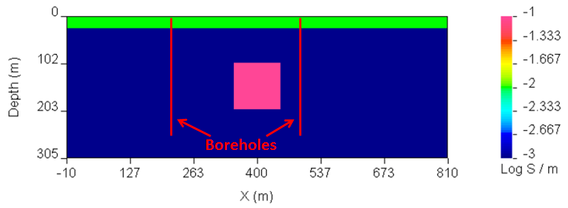
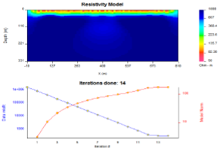
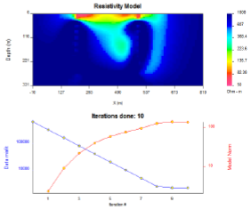
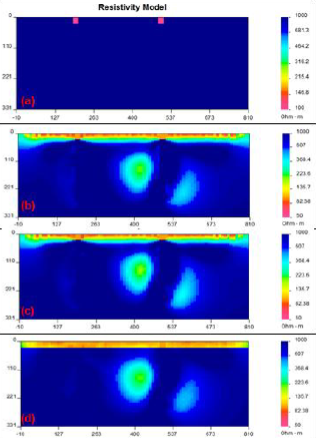
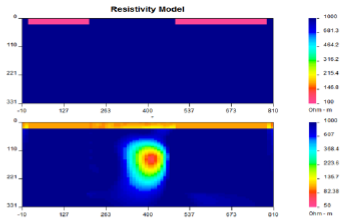

.. _boreholeExample:

Borehole examples
=================

The next example is based on synthetic borehole DC data, where the
simulated data are

#. Surface data simulated using dipole-dipole configuration

#. Borehole data simulated using larger dipole with one transmitter
   electrode placed in the borehole

#. Combination of surface and borehole data simulation

The synthetic data were generated using a 2D model (Figure
[fig:boreholeSyn]) that contains a 25-m thick overburden of 100 Ohm-m
over a 1000 Ohm-m half space. A 1 Ohm-m prism is located buried so that
its top is 100 m below the surface. The prism is 100 m :math:`\times`
100 m. The model was discretized onto a 6869 cell mesh (104 horizontal
by 66 vertical cells. Smallest cell equals 10 m by 5 m). The locations
of two boreholes are also shown in the figure.

   The synthetic model used for the three borehole examples.

The first synthetic data set is surface-only dipole-dipole array.
Electrodes are located every 25 m within the region (0 m, 800 m) and
each dipole-dipole survey used n=1,15. A total of 30 transmitter
locations were used. The total number of data is 345. The data were
contaminated with 5% Gaussian noise and inverted with a chi factor of 1
(see control input file configuration provided below). The inversion has
converged in 14 iterations. The results of the inversion of surface data
are presented in Figure [fig:synBsurf].

+-------------------------------+-------------------------------+
| OBS LOC\_XZ dc\_surface.dat   | ! General-formatted DC data   |
+-------------------------------+-------------------------------+
| MESH FILE mesh2d.msh          | ! Mesh                        |
+-------------------------------+-------------------------------+
| INVMODE CG                    | ! Use CG                      |
+-------------------------------+-------------------------------+
| REF\_MOD FILE 1e-3            | ! Reference model             |
+-------------------------------+-------------------------------+

   data set and (b) the associated convergence curves.

   (a) The recovered model from the inversion of synthetic surface data
   set and (b) the associated convergence curves.

Next the same conductivity model was used to simulate a synthetic
borehole data set for two boreholes located at :math:`x=200` and
:math:`x=500`. Electrodes were spaced every 25 m down each borehole to a
maximum depth of 250 m. The transmitter electrodes are located in the
opposite boreholes in all possible configurations. The schematic diagram
illustrating this survey configuration is shown in Figure [fig:bSchem].
This resulted in a total of 121 transmitters. Each transmitter
configuration is a common-current source for up to 20 receiver dipoles
in both boreholes. The total number of data is 2200. The simulated data
set was contaminated by 5% Gaussian noise and inverted using same
inversion parameters as the surface data set. The results are shown in
Figure [fig:bCurr].

.. figure:: ../images/bSchem.png
   :alt: A schematic of the survey configuration for the synthetic
   borehole example. Red dots mark the electrode positions.

   A schematic of the survey configuration for the synthetic borehole
   example. Red dots mark the electrode positions.

   down-hole data set and (b) the associated convergence curves.

   (a) The recovered model from the inversion of synthetic down-hole
   data set and (b) the associated convergence curves.

Further, the data sets were combined to accommodate 151 transmitter
locations and 2545 data. The combined data set was inverted with the
same parameters as each individual data set with the results shown in
Figure [fig:bAll]. As it is evident from these three inversions, the
surface geometry alone has strong limitations in depth resolution, while
the borehole configuration has limitations in near-surface recovery and
it is the combination of the two surveys, which allows better recovery
of the conductivity.

.. figure:: ../images/bAll.png
   :alt: (a) The recovered model from the inversion of synthetic
   down-hole and surface data sets and (b) the associated convergence
   curves.

   (a) The recovered model from the inversion of synthetic down-hole and
   surface data sets and (b) the associated convergence curves.

The inversion was then constrained using a weighting matrix with small
weights for the vertical interface at the depth of 25 m, ensuring a
sharper contrast across this boundary and large weights assigned to all
horizontal interfaces up to the depth of 25 m, ensuring a smooth
transition of electrical properties in this direction. This weighting
matrix is designed, assuming there is prior knowledge about the
overburden and defines the latter as a horizontal (laterally smooth)
structure with abrupt transition in the vertical direction. The control
file used for this inversion is shown below. The result of the inversion
is shown in Figure [fig:bAllWght].

+------------------------------+-------------------------------+
| OBS LOC\_XZ obs\_dc\_n.dat   | ! General-formatted DC data   |
+------------------------------+-------------------------------+
| MESH FILE mesh2d.msh         | ! Mesh                        |
+------------------------------+-------------------------------+
| INVMODE CG                   | ! Use CG                      |
+------------------------------+-------------------------------+
| REF\_MOD FILE 1e-3           | ! Reference model             |
+------------------------------+-------------------------------+
| WEIGHT FILE weights.txt      | ! Weight file                 |
+------------------------------+-------------------------------+

It is evident from Figure [fig:bAllWght], that not only did the
weighting function assure clean resolution of overburden, but it also
helped to remove some noise from the background, if compared with Figure
[fig:bAll].

.. figure:: ../images/bAllWght.png
   :alt: (a) The recovered model from the inversion of synthetic
   down-hole and surface data sets with a weighting constraint and (b)
   the associated convergence curves.

   (a) The recovered model from the inversion of synthetic down-hole and
   surface data sets with a weighting constraint and (b) the associated
   convergence curves.

The next step was to simulate a scenario, when the down-hole
conductivity data is available. This was done using the inactive cells
constraint. Figure [fig:bAllAct]a shows the new reference model with
fixed cells along :math:`x=200` and :math:`x=500` to the depth of 250 m.
The data were inverted using inactive cells constraint with no ability
to affect the neighbouring cells (Figure [fig:bAllAct]b), with ability
to interfere with the neighbours (Figure [fig:bAllAct]c) and in
combination with the weighting matrix (Figure [fig:bAllAct]d).

+------------------------------+-------------------------------+
| OBS LOC\_XZ obs\_dc\_n.dat   | ! General-formatted DC data   |
+------------------------------+-------------------------------+
| MESH FILE mesh2d.msh         | ! Mesh                        |
+------------------------------+-------------------------------+
| INVMODE CG                   | ! Use CG                      |
+------------------------------+-------------------------------+
| REF\_MOD FILE 1e-3           | ! Reference model             |
+------------------------------+-------------------------------+
| ACTIVE\_CELLS active.txt     | ! Active cell file            |
+------------------------------+-------------------------------+

Finally, the area of inactive cells was extended, simulating a scenario,
when a-priori information suggests that the anomalous conductivity lies
between the two boreholes. The final control file used for inverting
data under these constraints is presented below:

+------------------------------+-------------------------------+
| OBS LOC\_XZ obs\_dc\_n.dat   | ! General-formatted DC data   |
+------------------------------+-------------------------------+
| MESH FILE mesh2d.msh         | ! Mesh                        |
+------------------------------+-------------------------------+
| INVMODE CG                   | ! Use CG                      |
+------------------------------+-------------------------------+
| REF\_MOD FILE 1e-3           | ! Reference model             |
+------------------------------+-------------------------------+
| WEIGHT FILE weights.txt      | ! Weight file                 |
+------------------------------+-------------------------------+
| ACTIVE\_CELLS active.txt     | ! Active cell file            |
+------------------------------+-------------------------------+

The results of the final inversion are presented in Figure
[fig:bAllWghtAct].

   The inversion was then carried out such that the inactive cells both
   (b) influenced and (c) did not influence the neighbouring cells.
   Lastly, both the active cells and weighting file was combined to
   recover the model shown in (d).

   (a) The new reference model, accommodating the active cells. The
   inversion was then carried out such that the inactive cells both (b)
   influenced and (c) did not influence the neighbouring cells. Lastly,
   both the active cells and weighting file was combined to recover the
   model shown in (d).

   is shown in the top panel. The recovered model from the subsequent
   inversion using both weighting and inactive cell constraints is
   presented in the bottom panel.

   The reference model with an extended region of inactive cells is
   shown in the top panel. The recovered model from the subsequent
   inversion using both weighting and inactive cell constraints is
   presented in the bottom panel.
