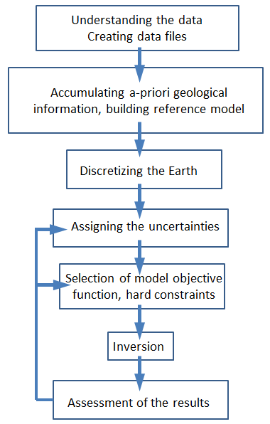
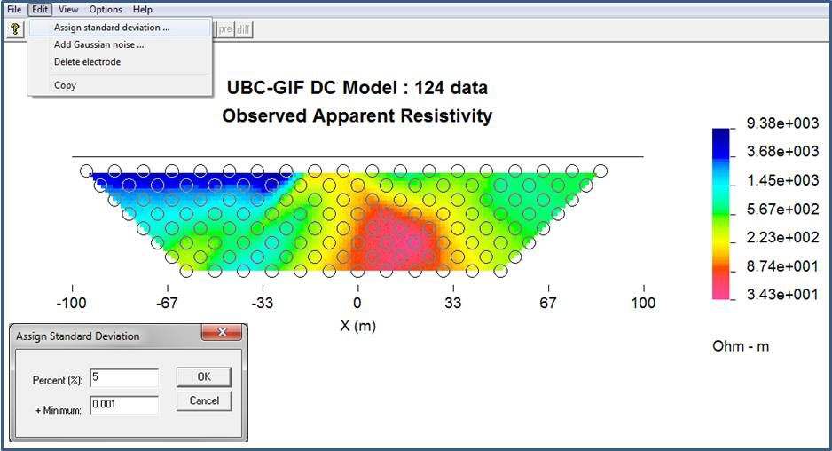
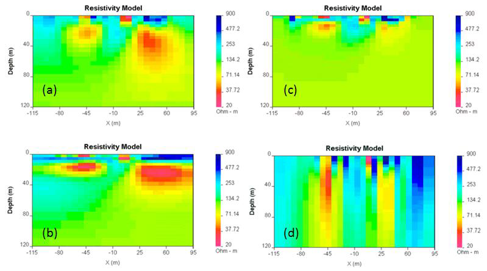
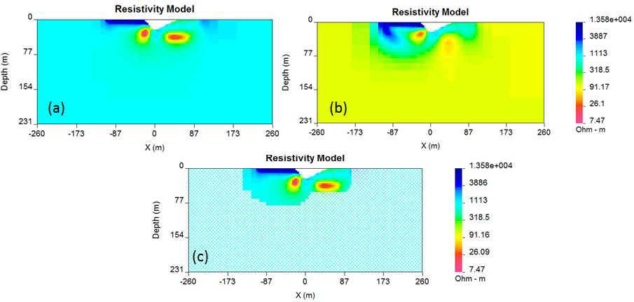

.. _Workflow:

Workflow
========

This section describes the standard workflow for running the inversion.
It is provided in a form of a checklist, where elements are linked to
other sections of this manual with a more detailed explanation of the
concepts. Figure :numref:`wkflw` shows the workflow guiding the user
through the steps of correctly performed inversion. Inverting data is
not a one-step process and each inversion should be carried out with an
understanding of each step of the process.

   
   Inversion workflow chart.

Understanding the data
----------------------

Before inverting the data, please ensure that you have good general
understanding of the resistivity/IP data. The following is the checklist
of the questions the user should have answers for, prior to preparation
of the data for the inversion:

-  What is the array configuration?

-  What are the electrode locations and spacing?

-  What are the units of the data?

-  Are the data normalized to unit current?

-  What is the total length of the survey line?

-  Are estimates of the noise on the data available?

The inversion code assumes that the data are measured voltages due to a
unit current in the transmitter. The formats are described in file
section. For display purposes however, the GUI provided with  will plot
data as apparent resistivities.

Accumulating prior information; building a reference model
----------------------------------------------------------

Prior information includes field geology, drill data, borehole
measurements and also an “educated guess” about the physical property
values and anticipated structures for a particular survey. The goal is
to include as much of this information as possible into the final
inversion and version  has much flexibility to do this. To be useful,
all prior information needs to be connected directly with the physical
property in question. Some examples of information that can be included
are:

-  A listing of the different rock units and the expected range of
   physical property values.

-  A characteristic geologic model for the deposit (example: typical
   porphyry geometry).

-  Physical property reference model. The reference model can be defined
   by a single value or it can be more complicated. Prior knowledge of
   geology and/or anomaly structure, and associated physical property
   values, should be incorporated into the reference model.

-  In addition to the reference model it is important to have a sense of
   its validity. If portions of the reference model arose from point
   measurements (surface or borehole) then high confidence might exist
   close to the measurement locations but uncertainty likely increases
   away from there. If the reference model has a contact zone, then
   knowledge about the uncertainty in its location is also sought. Thus,
   in the end, the goal is to have a reference model and also as much
   knowledge as possible about the data support that generated that
   model, what is known and what interpolation or hypothesis.

The above information can be input into the inversion in various ways.
The combination of reference models, choice of objective functions to
make structures more blocky or smooth, localized weightings for each
term in the model objective function, bound constraints on the physical
properties, and the use of active and inactive cells allows the user
much flexibility to obtain a solution that is compatible with the data
and his knowledge about the deposit. This will be addressed further for
the workflow item concerned with selecting the model objective function
and constraints.

Discretizing the Earth
----------------------

For the 2D models of the Earth it is assumed that there is no variation
of the physical property perpendicular to the line of DCIP data. The
earth is represented by a cross-section and this 2D earth is discretized
using rectangular cells. Maxwell’s equations are solved using a finite
volume approach and the accuracy of the solution depends upon the cell
size and the total volume. Smaller cells are needed around current or
potential electrode sites where the fields or sensitivities change
rapidly. The data define a primary region of investigation but the earth
model must extend sufficiently far beyond that so the assumed boundary
conditions are satisfied (see Figure :numref:`fwdMsh` for details). It is
essential to verify the modeling mesh via forward modeling prior to
inverting the data. A half-space conductivity is forward modeled and the
predicted data from this forward modeling can be viewed. The apparent
resistivities should not deviate by more than several percent from the
half-space values used in the forward simulation.

Topography must be approximated using rectangular cells. When a mesh is
used with UBC-GIF codes, the program builds a discretized 2D Earth. The
topography is thus blocky.

Assigning uncertainties
-----------------------

For the inversion, each datum must be assigned an uncertainty. In
practice this is challenging because the uncertainty may arise from
additive noise, a misplaced electrode, 3D effects that are not modeled
by a 2D geometry, numerical modeling errors etc. It is assumed that the
error associated with :math:`d_i`, the i\ :math:`^{th}` datum, is
Gaussian with zero mean and standard deviation :math:`\epsilon`.
Estimating values of :math:`\epsilon` is aided by having some knowledge
about the acquisition of data in the field, the equipment used, and the
likely sources of noise. A general recipe for assigning uncertainty is:

.. math:: 
   \epsilon_i = p*|d_i| + f

where :math:`p` is a fractional percent and :math:`f` is a floor in the
same units of :math:`d`. The percentage is important when there is large
dynamic range in the data. For example, it helps capture errors that
arise from electrode mis-allocations. Percentages of 5-7% are usually
reasonable numbers to apply. The floor is a base measurement and
reflects the minimum value of the signal that can be measured with the
instrument. For example, a percentage (say 20%) of the average value of
the voltages measured with at the largest electrode spacing might
suffice as a floor value. It is extremely important not to set the floor
to a value that is unrealistically small. If this is done then the
inversion algorithm will concentrate its efforts on fitting data that
have very small amplitude. An example of using a floor based upon data
from a largest electrode separation and a percentage is shown in Figure
:numref:`DCVscreen`.

   
   Assigning standard deviations using the GUI.

In Figure :numref:`DCVscreen`, the floor value of 0.001 has been assigned
followed by 5% noise in the data. These values can be revised upon the
assessment of the inversion results. Errors can also be adjusted for
individual data points if you suspect any datum is particularly noisy.
For example, it is not uncommon for all data values recorded at one
electrode location to have additional noise, due for example to a poor
electrical contact, a nearby metallic fence, or other reasons. In
standard form, the data misfit :math:`\Psi_d` is calculated according to
equation :eq:`phid`. This is appropriate when the data errors are
independent and Gaussian with zero mean and standard deviation
:math:`\epsilon`. In reality, however, some data might have very large
errors. These are and if an incorrect uncertainty is supplied, the
weighted difference will be very large and this datum will contribute
disproportionately compared to other data. This arises because of the
squaring operation in equation :eq:`phid`. In order to handle situations
where there are outliers, a more robust norm such as a Huber norm can be
implemented (See for details) can be implemented. The Huber norm is
calculated according to equation :eq:`Huber`. It has a user-specified
coefficient and acts like a hybrid between :math:`l_1` and :math:`l_2`
norms. Essentially normalized misfits with a value less than are
evaluated using :math:`l_2` and those above are evaluated using
:math:`l_1`.

Selection of model objective function
-------------------------------------

The model objective function is specified in equation :eq:disMOF` and is
a critical component of the inversion procedure. It is an important
conduit for incorporating geologic information. It controls the of model
that will be generated and also geologic detail. The inversion algorithm
will find a model that minimizes this function subject to the constraint
that the chosen model can generate predicted data that satisfy the
misfit criteria. The model objective function can be subdivided into two
components: the smallness (:math:`\boldsymbol{\vec{W}}_s` components) and smoothness
(:math:`\boldsymbol{\vec{W}}_x` and :math:`\boldsymbol{\vec{W}}_z` components). The components
work hand-in-hand and the model objective function will

#. try to find a model that is as close as possible to a reference model
   defined either as a half space (by default a half space with a
   resistivity equal to a weighted average of measured apparent
   resistivities), or as some other, more complicated model defined by
   the user (if there is enough prior knowledge), and

#. be as smooth as possible in the X and Z directions. The reference
   model can be left in or omitted in the derivative terms.

The significance of each component is controlled using the coefficients
:math:`\alpha_s, \alpha_x,` and :math:`\alpha_z,`. Therefore the user
can request a model that emphasizes either component 1 (smallness) or
component 2 (smoothness). The weighting functions :math:`\boldsymbol{\vec{W}}_s`,
:math:`\boldsymbol{\vec{W}}_x` and :math:`\boldsymbol{\vec{W}}_z` can be incorporated to enforce
more detailed information about the structure. Default values of these
coefficients are determined by the program based upon the length scales
of the survey and mesh.

Figure :numref:`alphaFig` illustrates the effect of changing smallness and
smoothness parameters on the inversion results. For the program DCIP2D
V5.0, the default specifications for these “alpha” parameters have been
found to work well as a first attempt, but experimentation and
adjustment of the parameters defining the desired model type may be
needed upon assessing the inversion results.

   
   Effects of different values of :math:`\alpha_s, \alpha_x, \alpha_z`:
   (a) [0.01,1,1]; (b) [0.01,1,0.01]; (c) [1,0.01,0.01]; and (d):
   [0.01,0.01,1]. All models produce the same data.

In addition to the smallness and smoothness coefficients, the new
version of offers additional degrees of freedom to edit the model
objective function. It is now possible to define the reference model in
arbitrary form, as specified in equation :eq:`Ekblom`. The parameter
:math:`\rho` which takes values :math:`1\leq\rho\leq2` controls the
character of the model. If :math:`\rho=1` then the recovered model will
tend to be while if :math:`\rho=2` we obtain our usual :math:`l_2`
smooth model. Again, the reference model can be included, or not, in
these terms. Examples of using this new objective function are shown in
the section of the manual and additional detail about the numerical
implementation is provided in section. Bounds constraints can be imposed
on the model using the projected gradient method
:ref:`CalamaiMore87`. Each cell can be provided with an
upper and lower bound (:math:`m^l` and :math:`m^u`), such that
:math:`m^L_i\le m_i \le m^u_i`.

Evaluation of the results
-------------------------

The following steps should be taken on order to properly assess the
results of an inversion:

#. Check the file. This file contains all the information about the
   input parameters and the inversion progress. Here are some key
   concepts of checking the log file:

   -  Did the inversion end with convergence?

   -  Have all the correct files been incorporated and inversion
      parameters properly set?

   -  Was the target misfit achieved?

   -  How many iterations were performed?

#. Predicted data should be compared to the observations using the GUI.
   The observed data and the predicted data should look nearly
   identical. To see variations between them, click the button in the
   data viewing window. This changes the second pseudo-section to a ,
   which shows the differences between the two data sets (Figure
   :numref:`misfit`. The normalized misfit map (normalized by the assigned
   standard deviation) should look random, with maximum values of some
   small percentage of the measured data (based upon noise
   specifications).

   .. figure:: ../images/alpha.png
      :name: misfit

      (a) Comparison of predicted data with the observed data. (b)
      Viewing the difference between the predicted data and observed
      data, normalized by standard deviation.

#. The resulting model should be checked using the GUI (provided with )
   Select in the menu in this GUI to specify how many padding cells to
   drop from the display. You can also adjust the minimum / maximum
   values for the colour scale - necessary for comparing various models
   (see GUI usage manual for details). The progress of the inversion (or
   the convergence curve) during its iterations should also be checked
   (Figure :numref:`convGUI`). In the model viewing window, the algorithm’s
   progress can be displayed graphically by selecting the “Curves”
   toolbar button in the menu. The resulting graph shows how the values
   of misfit and model norm varied at each iteration. ( is the value of
   the model objective function - this is what we are trying to . The
   algorithm is programmed to add structure gradually in order to find a
   model that explains the data - i.e. it works on reducing the misfit
   value (blue curve) until the target misfit is reached. Then it must
   try to minimize the model norm without changing misfit. Thus, you
   should see a slight drop in the model norm value (red curve) until no
   more adjustments can be made to improve the situation.

   .. figure:: ../images/convGUI.png
      :name: convGUI

      Viewing the model and the inversion progress.

#. Is the model geologically reasonable? It is important to decide
   whether the resulting model is geologically reasonable. This final
   consideration is more subjective. A simple example is shown here, in
   Figure :numref:`fitFig` in which data produced by calculating data over
   the 2D model (Figure :numref:`fitFig` a) are inverted twice to produce two
   inversion results which are both inadequate. Figure :numref:`fitFig` b
   shows the model, which is (a model recovered when the target misfit
   was too large). The program has stopped looking for details when
   predictions look only somewhat like observations. The image in Figure
   :numref:`fitFig` c show an model (a model recovered when the program has
   tried too hard to find details that explain every nuance in the
   observation and resulted in adding structure, which does not exist).
   In both cases the should be reviewed. In the case it should be made
   smaller, in case, bigger..

   .. figure:: ../images/underOverfit.png
      :name: fitFig

      Viewing the model and the inversion progress.

Another important concept to keep in mind during the verification of the
inversion results is the depth of investigation concept. Some of the
structure observed in the final model is strongly controlled by the data
but other structure is controlled by the details of the regularization
functional. By performing two inversions with different reference models
or by computing the sensitivities it is possible to obtain some insight
regarding which areas of the model are not controlled by the data. These
should be removed (or blurred out) from the image before final
presentation. An example of this concept is shown in Figure :numref:`DOI`.
The models in (a) and (b) were respectively recovered from inversions
using reference models of a 1000 ohm-m and a 106 ohm-m (given by a
default inversion). The DOI analysis was carried out and a threshold
value of 0.5 was used to omit parts of the model domain on the model
recovered from a 1000 ohm-m background. It is
important to note that the model GUI will also perform this analysis
given the file or multiple output files.

   
   (a) The model recovered using a 1000 ohm-m background. (b) The model
   recovered from using a background of 106 ohm-m. (c) The model in (a)
   truncated to the depth of investigation using a cutoff value 0.5.
