.. _dcinvexample:

DC Inversion of the forward model
=================================

The goal of this section is to illustrate the performance of the inversion
program when different combinations of input parameters are used. We have
carried out nine DC inversions of the simulated DC data presented in the
:ref:`Forward section<fwdexample>`.

 - :ref:`Default parameters<invDefault>`
 - :ref:`CG solver and reference conductivity<invCGref>`
 - :ref:`Depth of Investigation analysis (DOI) <invDOI>`
 - :ref:`Geological reference model<invRefModel>`
 - :ref:`Inactive cells constraint<invInactiveCells>`
 - :ref:`Cell weights<invWeighted>`
 - :ref:`Huber norm<invHuberNorm>`

.. We use several synthetic examples to illustrate various aspects of **DCIP2D**. The
.. emphasis of the test examples is to show the newly added features of the
.. inversion programs. A synthetic conductivity model is shown in Figure
.. :numref:`fwdAppRes` and resultant synthetic data I shown in Figure
.. :numref:`fwdTrueCropped`.

.. .. figure:: ../images/fwdTrue.png
..    :figwidth: 75%
..    :align: center
..    :name: fwdTrue

..    The synthetic model consists of two conductors buried in a uniform halfspace overlain
..    by an overburden of variable conductivity. A V-shaped valley simulates the surface topography.
..    The region of interest is outlined by the white lines, but padding cells are added so that the correct
..    boundary conditions can be applied during the forward modelling.

.. The synthetic model consists of two conductors buried in a uniform half
.. space, which is overlain by an overburden of variable conductivity. A
.. V-shaped valley is cut out to simulate the surface topography. The
.. background has a conductivity of 1 mS/m and the overburden has a
.. conductivity of 0.1 mS/m on the left and 2 mS/m on the right. The buried
.. conductor on the left has a dip of 135o and a conductivity of 100 mS/m,
.. and it is buried at a depth of 20 m to the top. The conductor on the
.. right is a horizontal and conductive block of 100 mS/m buried at a depth
.. of 25 m. The forward modelling uses a mesh of 48 cells in the
.. x-direction and 27 cells in the z-direction so there are 1296 cells. In
.. the survey, surface electrodes are located every 10 m in the interval
.. :math:`x=(-100,100)` m. We have simulated pole-dipole data with a=10 m
.. and n=1, 8. The data have been contaminated with independent Gaussian
.. noise whose standard deviation is equal to 5% of each accurate datum.

.. _invDefault:

DC Inversion: All default
-------------------------

First, the synthetic data were inverted using the all-default option:

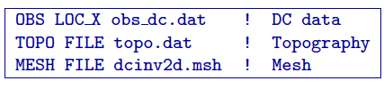

In this file, the first line indicates that the `data file`_ (*obs_Uncert_5pc_0p001V.dc*) is of surface format.
The second line contains the reference to `topography file`_ (*TOPO.DAT*). The third
line is in reference to the `mesh file`_ (*dcinv2d.msh*). If there is no topography it is
not necessary to include either the mesh, or the topography file in
all-default mode.  will construct a mesh in automatic mode and consider
topography to be zero. In our case we have user-defined topography and
mesh file is provided. The result of the all-default inversion is shown
in Figure :numref:`alldefault`. The best fitting half space was
approximately 120 ohm-m.

.. _data file: https://github.com/ubcgif/dcip2d/blob/master/example/Inv/obs_Uncert_5pc_0p001V.dc
.. _topography file: https://github.com/ubcgif/dcip2d/blob/master/example/TOPO.DAT
.. _mesh file: https://github.com/ubcgif/dcip2d/blob/master/example/FDMESH.DAT

.. figure:: ../images/alldefault.png
   :name: alldefault

   Inversion of synthetic DC data using all-default mode.

.. _invCGref:

DC Inversion: CG solution using a constant reference model
----------------------------------------------------------

In the next example, definition of some parameters has been set to
user-defined and changed. In real life this can be done if there is a
higher level of certainty regarding some starting parameters (prior
information). The control file for the next example is provided below:

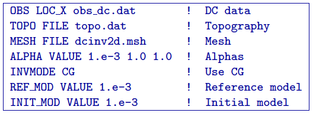

In this example, the fourth line indicates that the smallness
coefficient (:math:`\alpha_s`) is now user-defined (set to 0.001). The
fifth line means that the system solver has been switched from default
(Singular Value Decomposition or SVD solver) to the Conjugate Gradient
solver (CG). The reference model has been set to 0.001 S/m (or 1000 Ohm
m). The initial model has been set to the same as reference model. The
results of applying these control file parameters are shown in the
inversion model in Figure :numref:`synEx2`.

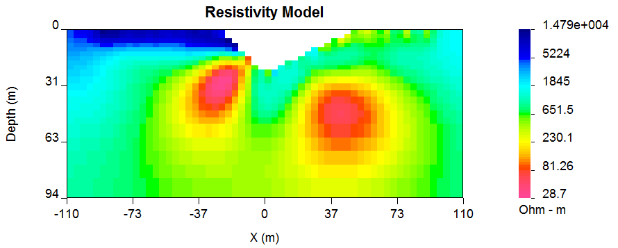

   Inversion of synthetic DC data using user-defined smallness parameter
   (:math:`\alpha_s`\ s) 1000 Ohm m half space as both: reference and a
   starting model.

The basic features of the models in Figure :numref:`alldefault` and Figure
:numref:`synEx2` are similar. Both conductors have been located and so has
the resistive overburden on the left. (Compare with the synthetic model
in Figure :numref:`fwdTrueCropped`). Nevertheless, there are differences.
Figure :numref:`synEx2`, which uses a more resistive reference model,
supports the interpretation of closure for the body on the right. There
is also an odd structure emanating from the left most part of the
resistive overburden observed in Figure :numref:`alldefault` that is not
observed in Figure :numref:`synEx2`. The primary differences between the two
models can be explained through the use of a DOI (Depth of
Investigation) plot. For the present we use Figure :numref:`synEx2` as a
reference and Figure :numref:`alldefault` as an additional model.

When the inversion volume is cut with respect to the DOI, then
differences in the images are no longer so apparent. For the remainder
of the example section we shall use the reference the model described in
Figure :numref:`synEx2` (1000 Ohm m half space) as the default model.

.. _invDOI:

Depth of Investigation (DOI)
----------------------------

Models produced by inversion of DC resistivity data tend to approach the
background conductivity of the reference model. At those depths the
recovered model is no longer being influenced by the data. We can use
this result to help estimate our depth of investigation. If there are at
two reasonable models obtained using different reference models, the two
models can be compared to identify which regions of the model are most
significantly affected by the measurements. The results of doing this
are explained next.

Using **DCIP2D**, the method is applied within the DCIP2D-MODEL-VIEWER GUI,
using *Depth of investigation* option in the menu.
There must be a second model that was recovered using the same mesh as
the one being observed. Any two different inversions results can be
used. Here we use 1000 Ohm-m halfspace as our best model and we want blank
out those sections of the model that are not well controlled by the
data. A second inversion using a background of 106 Ohm-m (the default
value from the code) and used that to compute the DOI. In Figure
:numref:`doiInvExample` (a-b) shows the model with cutoffs of 0.1 and 0.4.

.. figure:: ../images/doiInvExample.png
   :name: doiInvExample

   Assessing the depth of investigation (DOI): (a) based on recovered
   model (cut-off=0.1), (b) based on recovered model (cut-off = 0.4),
   (c) based on sensitivity (cut-off = 0.5), and (d) based on
   sensitivity (cut-off = 0.6).

Another option to assess the depth of investigation is through the
analysis of the sensitivities. In **DCIP2D**  there is a capability to visualize
the sensitivities using the DCIP2D-MODEL-VIEWER GUI (Figure :numref:`doiInvExample` c and Figure
:numref:`doiInvExample` d). Generally, the lower sensitivities correspond to less
reliable model parameters (deeper-seated cells); higher sensitivities
correspond to those model cells, which have most effect on the data
(usually closer to surface). A good way to assess the DOI is by plotting
the model on the full mesh extent (including the padding cells, Figure
19). In this figure we use the DOI evaluated from 1000 and 106 Ohm-m
half spaces (that is, the same as Figure :numref:`doiInvExample` a) and Figure
:numref:`doiInvExample` b). As the DOI threshold decreases we limit the region of
the model to that which is most controlled by the data. See (Figure
:numref:`doiInvSens` a-c). The final choice of cutoff is selected by the
user.

.. figure:: ../images/doiSensInvExample.png
   :name: doiInvSens

   Assessing the depth of investigation (DOI): (a) based on recovered
   model (cut-off=0.1), (b) based on recovered model (cut-off = 0.4),
   (c) based on sensitivity (cut-off = 0.5), and (d) based on
   sensitivity (cut-off = 0.6).

.. _invRefModel:

DC Inversion: Non-uniform reference model
-----------------------------------------

The next example is very similar to the previous inversion, with an
exception that a different reference model is introduced (Figure
:numref:`exRef`). As opposed to the previous example, where the reference
model was set to a 1000 Ohm m half space, the new model includes an
elongated conductive (10 Ohm m) rectangular block. The elongated block
has the same value as the conductivity anomaly but the boundaries do not
coincide. Moreover the block in the true model has smoothed boundaries.
In summary, the supplied reference model has captured some aspects of
the true conductivity but it is not an exact reflection of what is
there. This example has been contrived to illustrate what happens with
the options of including, or omitting, the reference model in derivative
terms in the objective function according to equations :eq:`disMOF` and
:eq:`mofNOref`.

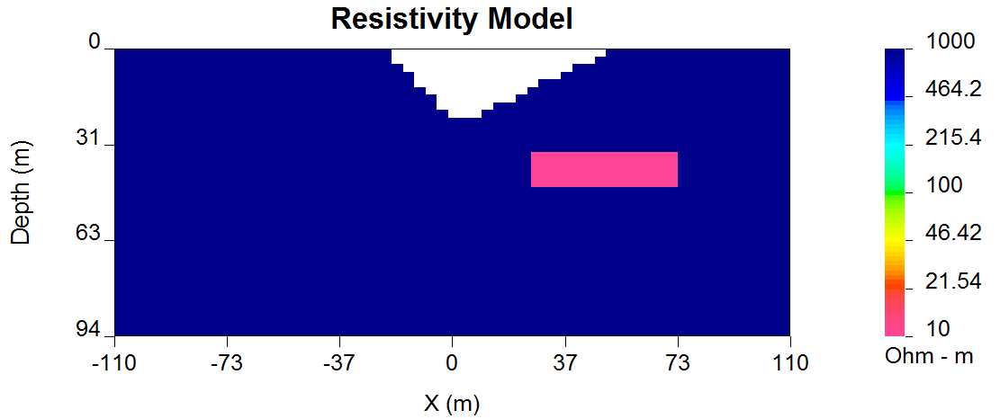

   Reference model applied for the synthetic example illustration.

In the first example (control file provided below) the reference model
was used in only the smallest model component.

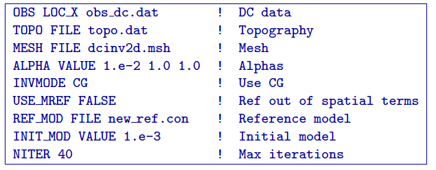

In this control file line 7 now indicates that the reference model
should be read from a file, rather than assigned a constant value; line
6 indicates that the reference model should be defined in non-derivative
terms and line 9 is indicating that the maximum number of iterations for
this inversion should not exceed 40. The results of this inversion can
be seen in Figure :numref:`synWithRef`.

.. figure:: ../images/synWithRef.png
   :name: synWithRef

   Reference model applied for the synthetic example illustration.

This is a superior model compared to that in Figure :numref:`synEx2`. The
magnitude of the conductive anomaly is much better recovered, although
at 7.6 Ohm-m it is slightly less resistive than the true value of 10
Ohm-m. It has a well-defined elongated shape with steep gradational
boundaries that are good representations of the true model. If we are
more confident in the locations of the boundaries of the block in the
reference model, then this can be incorporated into the inversion. We
next carry out an inversion in which the reference model is included in
the derivative terms. Below is the control file used for this inversion.

.. figure:: ../images/dcinv_useMref.png
   :figwidth: 75%
   :align: center
   :name: dcinv_useMref

The line (*USE_MREF_FALSE*) from the previous example has been eliminated, switching the
inversion into the default mode (reference model is defined in the
derivative terms in default mode). This line also could have been
changed to *USE_MREF_TRUE*).

The result is shown in Figure :numref:`synWithRefIn` and it produces a model
that has boundaries at the same location as the reference block and
there is even more over-shoot of the conductivity. For this example
however, putting in the reference model into the derivative terms is
stronger information than is justified. In most cases, the previous
solution, where the reference model was left out of the derivative terms
is preferable.

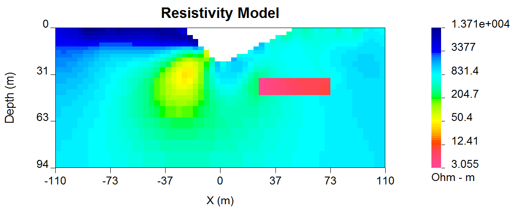

   Reference model applied for the synthetic example illustration.

This is not always the case. Consider a situation where the goal is to
find a body beneath an overburden layer. The model and the reference
model are shown in Figure :numref:`synOverBurdenTrue`. It might be supposed
that information about the overburden thickness and its resistivity have
been obtained through drilling. Two inversions are carried out. In the
first (Figure :numref:`synOverBurden` a) the reference model is omitted from
the derivative term and the overburden boundary is characterized by a
smooth transition. In the second case (Figure :numref:`synOverBurden` b) the
reference model is included in the derivative terms and the result is a
cleaner delineation of the overburden and better definition of the
sought body.

.. figure:: ../images/synOverBurdenTrue.png
   :name: synOverBurdenTrue

   A conductive block underneath the overburden: (a) the true model and
   (b) the reference model.

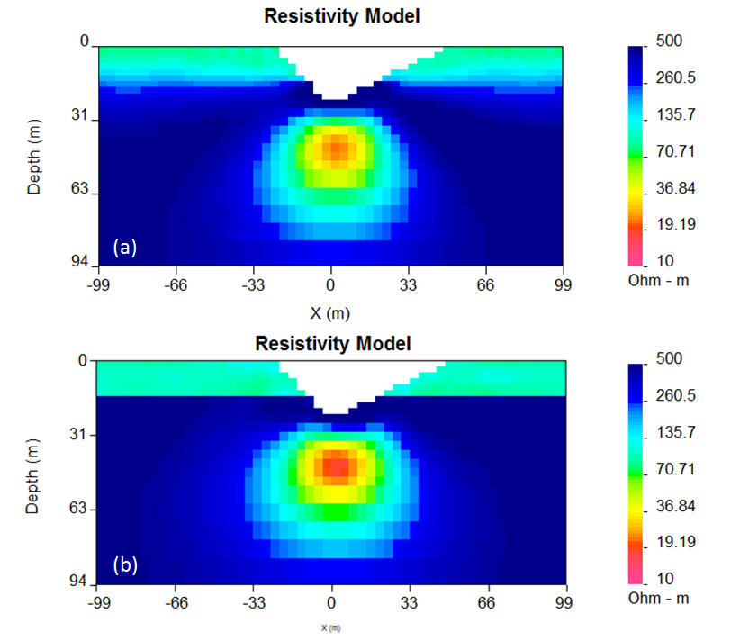

   Inversion results when (a) the reference model is not included in the
   derivative terms and when (b) the reference model is defined in
   derivative terms.

.. _invInactiveCells:

DC Inversion: Incorporating inactive cells constraint
-----------------------------------------------------

In the next example it is illustrated how drilling data can be
incorporated in the inversion using fixed cells constraint. In this
example, the reference model has been set to the same elongated
conductive block model as shown in Figure :numref:`synOverBurdenTrue`. The
difference is that in this case additional information has been
incorporated by fixing some reference model cell values. The values are
taken from the reference model file (*ref_new.con*) but their values are fixed using
active cells file (*ACTIVE_CELLS active.txt*), defined in line 6 of the control file provided
below.

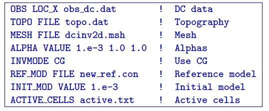

The active file format was previously discussed within the subsection :ref:`Model <model2d>` in the
section of the manual, however another example is provided below:

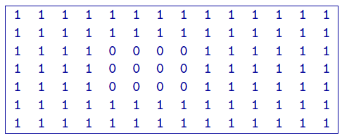

The format of this file is consistent with the model file, and the
values equal to 1 define the model cells marked as active, while values equal
to 0 define the model cells marked as inactive(without the capability affect the
neighbouring cells). The case when inactive cells do not influence their
neighbours is shown in Figure :numref:`synAct`.

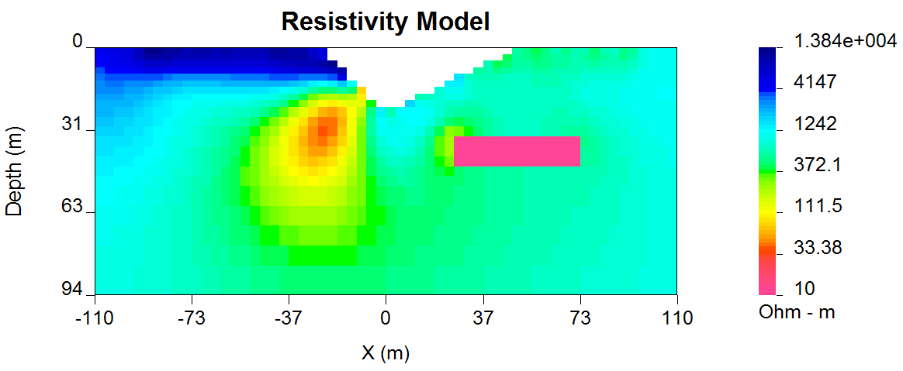

   Recovered model when the reference model cells are inactive and they
   do not influence the neighbouring cells.

If it is desired to have the inactive cells influence the values of
neighboring cells, then their values are set to -1 as in the file below.
The resultant inversion model is shown in Figure :numref:`synAct2`. The
region of high conductivity has been extended away from the reference
model and the anomaly smoothly transitions to the background.

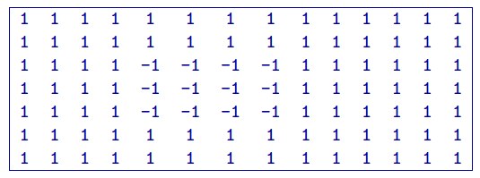

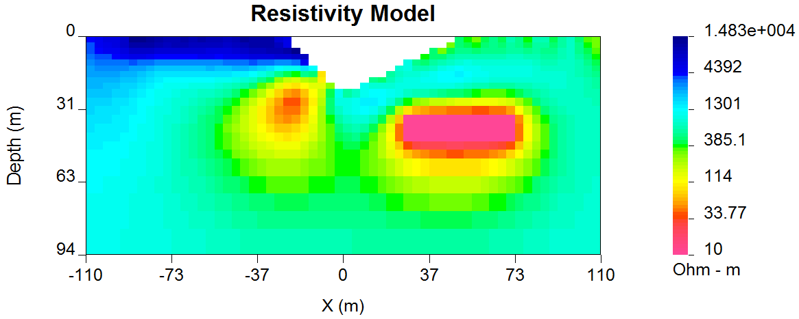

   Recovered model when cells are inactive, but their values influence
   those of the neighbouring cells.

.. _invWeighted:

DC inversion: Using weighting functions
---------------------------------------

The next example illustrates the situation when prior information is
incorporated using the weighting function file. The synthetic model for this
example is the same as illustrated in Figure :numref:`synOverBurdenTrue`.
Instead of reference model, a weigthing file was used. The control file used for
this inversion is shown below. The reference to the weighting file is
provided in line 11 (*WEIGHT W.dat*).

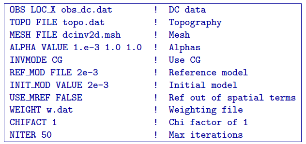

The recovered model is illustrated in Figure :numref:`synOverBurdenWght` and
is very similar to the model shown in Figure :numref:`synOverBurden` b. The
alternative of using a weighting file instead of the reference model
facilitated the technical implementation of the prior constraints and
brings an additional degree of freedom in being able to adjust the level
of certainty in the a priori information by editing the weighting
coefficients. In our case, the weighting coefficients were edited for
the :math:`\boldsymbol{\vec{W}}_z` matrix, where the sixth interface (corresponding
to the bottom of the overburden) was set to 0.1 (as opposed to default
weights of 1.0).

.. figure:: ../images/synOverBurdenWght.png
   :name: synOverBurdenWght

   Recovered model from the inversion using weighting file

.. _invHuberNorm:

DC Inversion: Using the Huber norm for data misfit
--------------------------------------------------

The next example illustrates the effects that large data errors can have
on the inversion and how these can be ameliorated with the Huber norm.
The data are the same as used in previous examples except that 5 data
have been severely perturbed. The inversions are carried out with the
same standard deviation estimates, as used previously, a 1000 ohm-m
background, and a data file contaminated with bad apparent resistivity
values. Figure :numref:`huberCont` shows the contamination introduced to the
apparent resistivity file used for the inversions.

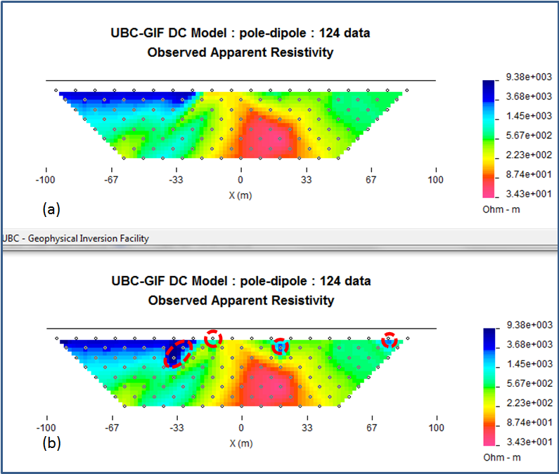

   The (a) true data and (b) data contaminated with noise that will be
   inverted.

The contaminated data were inverted using a standard :math:`l_2` norm
for the data misfit. The control file for this inversion is provided
below:

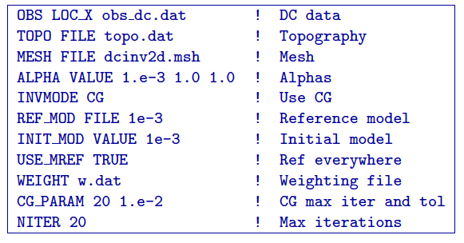

The results of the inversion are shown in Figure :numref:`synHuberInv`. The
inversion ran for 20 iterations and the target misfit was not achieved
and there were many artifacts. The reason is that the great effort was
being made to fit the five erroneous data.

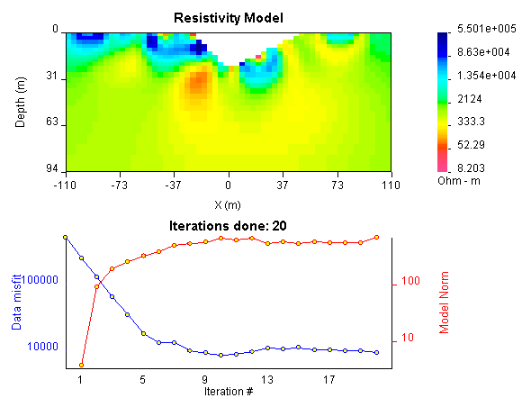

   Recovered model (top) and conversion curves (bottom) from the
   inversion of the contaminated data. The data misfit utilized an
   :math:`l_2` norm.

In Figure :numref:`synHuberData` we show the observed data and the
normalized misfit. Three of the five outliers are distinct and they
contribute a value of 2067.05 to the final misfit of 9303. By
recognizing them as outliers, they might be winnowed from further
analysis but two erroneous data have been over fit by the modeling and
as a result produced incorrect structure. This has led to other, higher
quality data, having large misfits. This is characteristic of non-robust
norms.

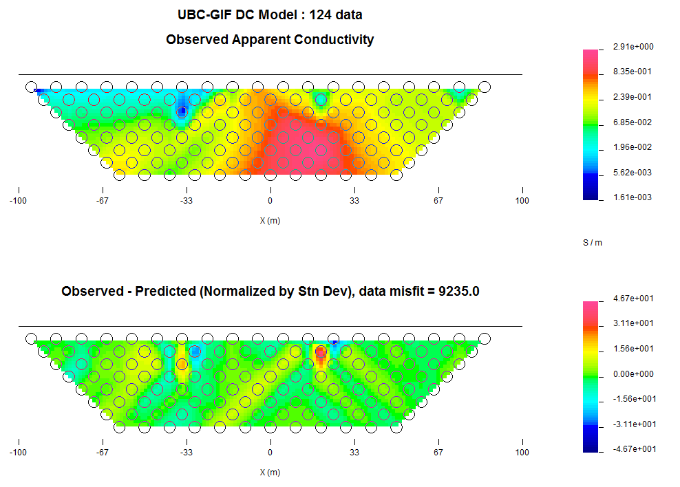

   Observed data (top) and the normalized difference (bottom) from the
   inversion using an :math:`l_2` misfit measure.

In order to combat the effect that outliers in the data file may have on
fitting the data using the :math:`l_2` measure, Huber norm was imposed
on the data fit. The example of the control file with Huber norm is
shown below:

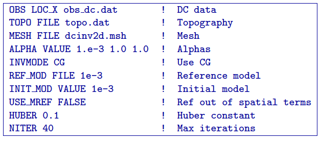

Line 9 in this control file has been set to so that all normalized data
misfits with value greater than 0.1 will be evaluated with the
:math:`l_1` measure. The results are shown in Figure :numref:`synHuber2`
and they appear much better, than in previous case. Nevertheless, they
can still be improved by recognizing the existence of the highly
erroneous data and winnowing them from the inversion. incorrect
structure. This has led to other, higher quality data, having large
misfits. This is characteristic of non-robust norms. Although the
recovery is far from perfect, the main conductor bodies are now shown
with satisfactory detail, comparing to the :math:`l_2` normalization.

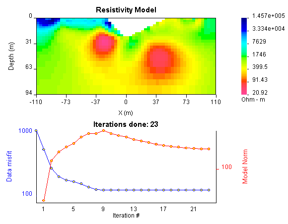

   (top) The recovered model from inversion of contaminated data using
   Huber norm for the data misfit and (b) the convergence curves.
