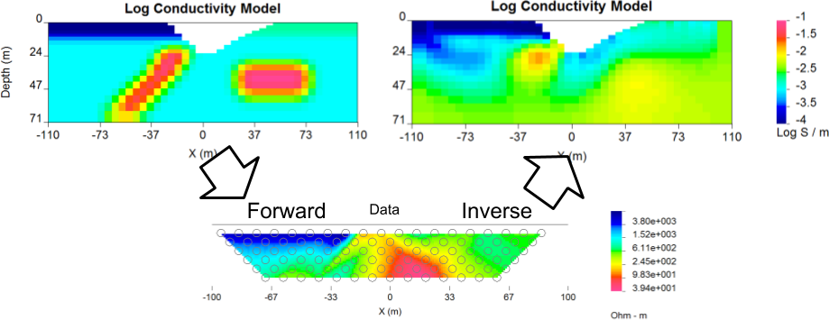

.. _Examples:

Examples
========

This section uses a simple synthetic conductivity and chargeability model to
showcase the forward and inverse capabilities of DCIP2D.
The model, data and inversion results can be downloaded from `here`_

.. _here: https://github.com/ubcgif/dcip2d/raw/master/example/GIFmodelDCIP.zip

.. toctree::
        :maxdepth: 1

        Forward Model<fwdexample>
        Inversion of the DC forward model<dcinvexample>
        Inversion of the IP forward model<ipinvexample>
        Large dataset example<largedatasetexample>
        Borehole example<boreholeExample>
        Field example<fieldExample>
