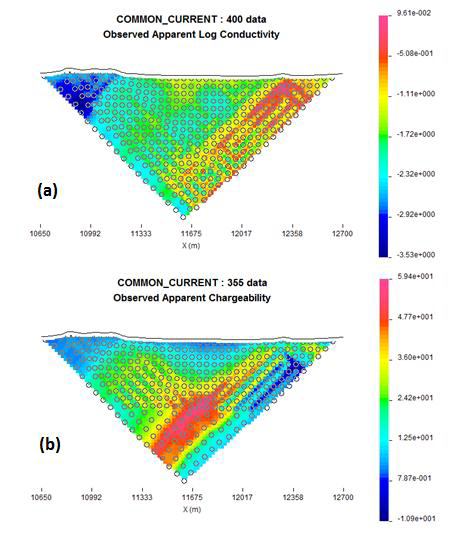
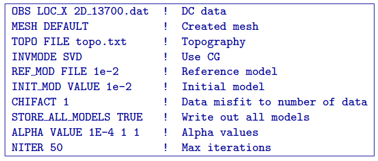
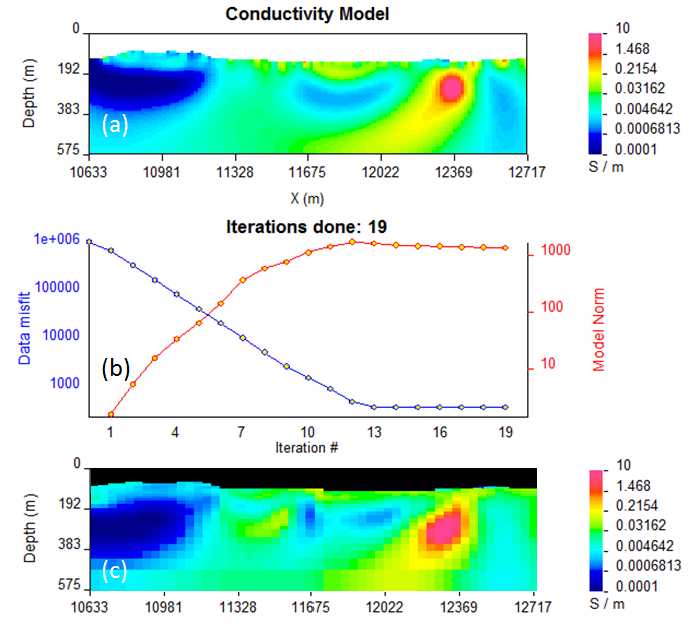
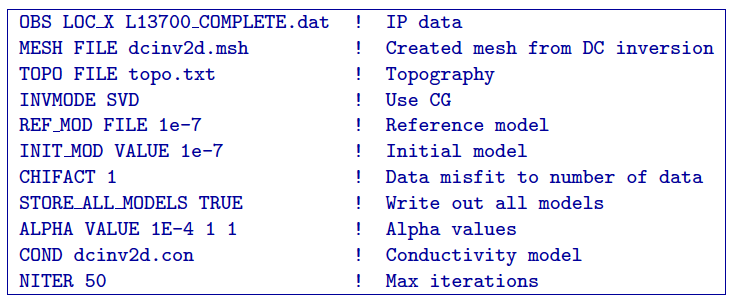
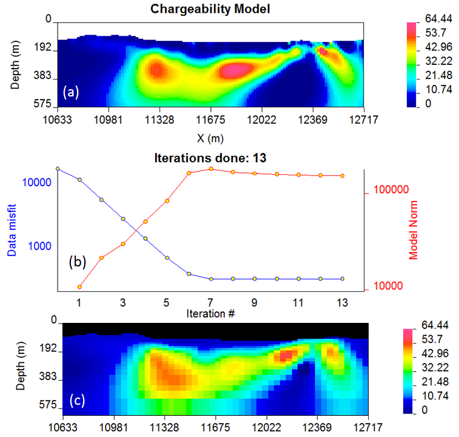
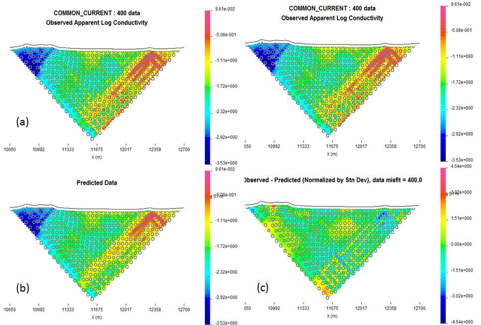
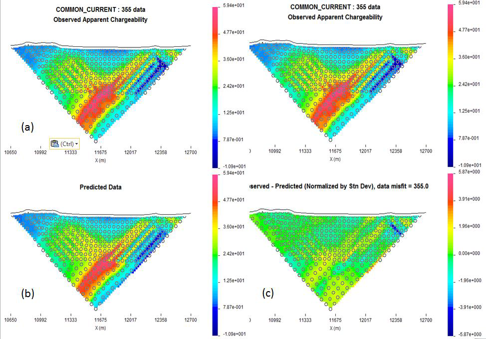

.. _fieldExample:

Field example
=============

In the next example the field data set had been collected over the Cluny
prospect in Mt. Isa area, Queensland, Australia by MIM Exploration Pty,
Ltd :cite:`rutley2001`. The data were collected using
pole-dipole and dipole-pole array configuration. The length of the
profiles reaches 2000 m in East-West direction. A total of 10 profiles
of DC and IP data were collected with electrode spacing of 50 m. There
is topographic disturbance along the profile ranging from 429 to 505
meters in absolute elevation above the mean sea level. The DC and IP
data, collected over profile 13700 are shown in (Figure :numref:`realData`).
The data sets were examined for bad data values (outliers) and based on
this criterion 45 data had to be eliminated from the IP inversion.

   The observed (a) DC and (b) IP data measured along profile 13700 over
   the Cluny prospect, Australia.

Resistivity inversion was carried out using the error assignment of
0.0001 base +5% of the data and constant uniform reference and starting
model (100 Ohm m). A default meshing option was used, resulting in
16.8-m wide and 8.33-m high cells in the core region. The control file
used for the inversion is provided below with user-defined smallness
coefficient and maximum number of iterations set to 50.
ented below:

The results of the inversion (Figure :numref:`realDataRec` a)) are based on
convergence to assigned misfit in 21 iterations (Figure
:numref:`realDataRec` b)). They were compared with the earlier results
acquired by code :cite:`rutley2001` and are shown in Figure
:numref:`realDataRec` c). The large conductor on the right hand side is a
black shale unit. The main geologic structure runs north-south and is
essentially perpendicular to the survey line. It is expected therefore
that the 2D inversion should produce geologically reasonable results.
This is substantiated by comparing this cross-section with a similar
cross-section extracted from the 3D inversion (Figures
:numref:`realDataRec` a) and :numref:`realDataRec` c)).

   (a) The recovered model from inverting DC data along profile 13700,
   Cluny prospect, Queensland, Australia and the associated (b)
   convergence curves. For reference, (c) the results acquired in 2001
   over the same profile.

The conductivity models recovered from the DC inversion were further
used to carry out the IP inversion. The IP inversion was carried out
using the same mesh as for the DC inversion and was further compared to
the 3D inversion carried out previously :cite:`rutley2001`.
Below is the control file used for the IP inversion:

The results of the inversion were once again compared to the
corresponding 3D IP inversion :cite:`rutley2001` and are
shown in Figure reffig:realIPres.

   (a) The recovered model from inverting IP data along profile 13700,
   Cluny prospect, Queensland, Australia and the associated (b)
   convergence curves. For reference, (c) the results acquired in 2001
   over the same profile.

The predicted data from the inversions has been verified against the
measured data and plotted in Figure :numref:`realPre1` and Figure
:numref:`realPre2`.

   (a) The observed DC data along profile 13700 and (b) the predicted
   data for comparison. The data misfit normalized by standard deviation
   is presented in (c).

   (a) The observed IP data along profile 13700 and (b) the predicted
   data for comparison. The data misfit normalized by standard deviation
   is presented in (c).

Both inversions (DC and IP) have successfully converged and the misfit
does not exceed 5 standard deviations, which is one of the criterions of
successful inversions. Another criterion is the verification of the 2D
results against the 3D results, which show very comparable results.
