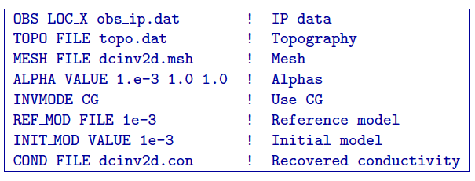
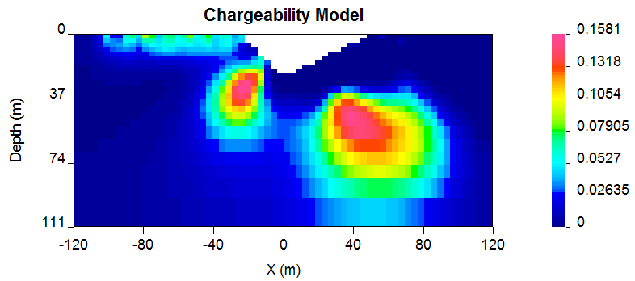
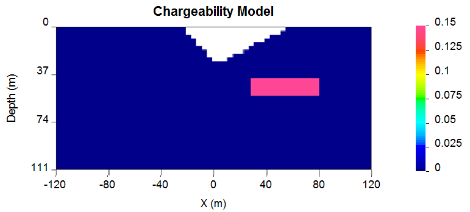
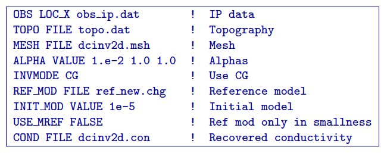
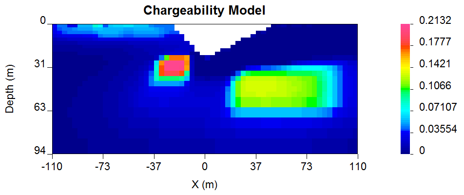
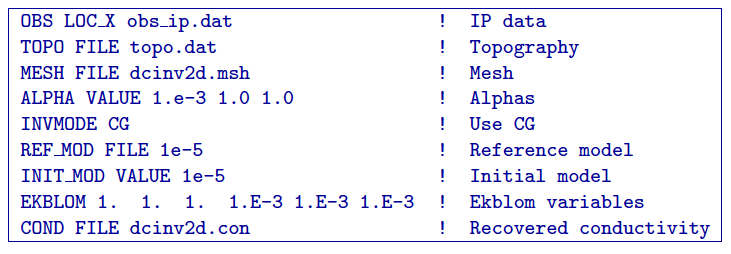
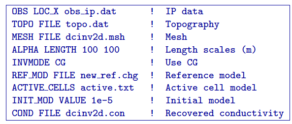
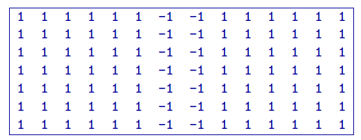
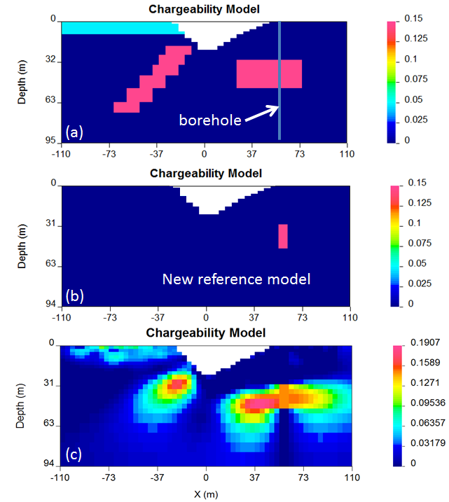

.. _ipinvexample:

IP Inversion of the forward model
=================================

The inversion of IP data is almost identical to the inversion of DC
resistivity data. The primary difference is that IP is a linear problem
and the forward modeling matrix is the sensitivity matrix from the DC
resistivity inversion. The IP inversion code has the same functionality
as the DC resistivity code and the control lines are identical. One
essential difference is that positivity is strictly enforced in the IP
inversion. IP data can be negative but the intrinsic chargeability is
always positive. There is no need to repeat all of the inversions done
for the DC. Rather, we will invert only a few examples to illustrate the
algorithm.

The inversion of IP data is almost identical to the inversion of DC
resistivity data. The primary difference is that IP is a linear problem
and the forward modeling matrix is the sensitivity matrix from the DC
resistivity inversion. The IP inversion code has the same functionality
as the DC resistivity code and the control lines are identical. One
essential difference is that positivity is strictly enforced in the IP
inversion. IP data can be negative but the intrinsic chargeability is
always positive. There is no need to repeat all of the inversions done
for the DC. Rather, we will invert only a few examples to illustrate the
algorithm.

The examples were designed to replicate the capabilities of DCIP2D, shown
using the DC examples. The conductivity models used for IP inversions
were mainly those, acquired from the corresponding DC inversions.

IP inversion: Zero-chargeability reference model
------------------------------------------------

The first example was carried out using zero-chargeability reference
half space and the conductivity model acquired from inverting the dc
resistivity with 1000 Ohm-m half space reference. The control file for
this inversion is shown below:

On the last line of this control file, there is the reference to the
conductivity file, an essential input parameter for an IP inversion.
This file has to come from a corresponding DC inversion, carried out
prior to the IP inversion. The results of this inversion are shown in
Figure :numref:`synIp1`.

   Recovered chargeability model for a zero chargeability reference
   model and 1000 Ohm-m conductivity model.

IP inversion: Non-uniform reference model
-----------------------------------------

In the next example, similarly to the DC inversions, we have introduced
a chargeable block into the reference model (Figure :numref:`synIPref`).

   The reference model applied to the synthetic example for
   illustration.

Further, the new reference model was introduced in the inversion and
omitted from the derivative terms. The control file for the inversion is
virtually identical as in case with analogous inversion of the DC data
and is provided below. The resulting inversion is shown in Figure
:numref:`recSynIPref`.

   Recovered model from IP inversion using the non-uniform reference
   model in the smallness term.

IP inversion: Using Ekblom measure to recover a blocky model
------------------------------------------------------------

In this next example, the geological information is incorporated in the
model objective function using the :math:`l_1` norm measure rather than
the default :math:`l_2` norm. This allows recovery of a blocky model.
The control file for this example is provided below, and the resultant
inversion model is shown in Figure :numref:`synIPblocky`.

.. figure:: ../images/synIPblocky.png
   :name: synIPblocky

   Recovered model from IP inversion Using :math:`l_1` measure (Ekblom
   norm) of model norm to recover a blocky model.

The resultant models are blocky and the central block has better defined
boundaries than the deep block on the right. This arises because the
right hand block is located close to the edge of the depth of
investigation for the survey. To illustrate this we superpose the depth
of investigation inferred by using the sensitivity function with a
cutoff of 0.5. This is shown in Figure :numref:`synIPblockDOI` to illustrate
the depth of investigation (DOI) the model has been plotted on a larger
scale.

.. figure:: ../images/synIPblockDOI.png
   :name: synIPblockDOI

   The depth of investigation (DOI) for the IP inversion with an
   :math:`l_1` model norm.

IP inversion: Reference model with inactive cells
-------------------------------------------------

This next example illustrates an inversion with a reference model with
fixed cells (inactive). In this example, the inactive cells are
representing a scenario when our constraints are acquired by
incorporating borehole information. Out synthetic borehole is located on
the profile at :math:`x=60` (Figure :numref:`synIPbore` a). This reference
model is now different and involves only the knowledge we have from the
borehole data (Figure :numref:`synIPbore` b). The inversion was carried out
in the mode, when the inactive cells may influence their neighbours and
resulted in the chargeability distribution shown in Figure
:numref:`synIPbore` c. In this mode the inversion extends the chargeability
of the fixed cells away from the reference block. The case is very
similar to the analogous example shown in the DC inversion. The control
file used for this inversion is provided below:

The active file is shown below, the structure has been edited so that two cells
(one in each direction) around the synthetic borehole are set inactive
and with the capability to influence the neighbours (i.e., -1)

   (a) The true chargeability model with the borehole location. (b) The
   new reference model created from the borehole information. (c)
   Recovered model with the borehole locations set to inactive with
   influence (-1) on neighbouring cells.
