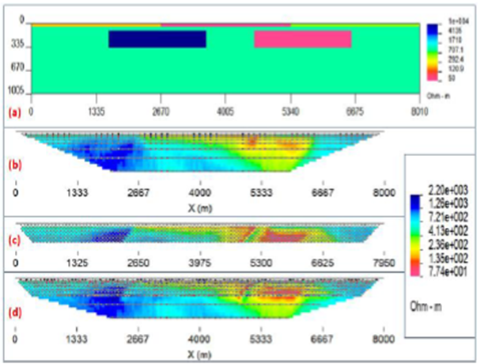
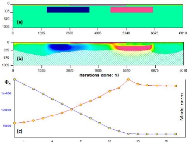
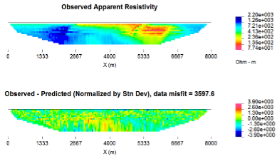

.. _largedatasetexample:

Large data set example
======================

In the next example a synthetic data set is introduced, where a Wenner
array is combined with a pole-dipole array and covers an 8-km long
profile. The synthetic model is a 1000 Ohm- m half space covered by a
50-m thick overburden of variable electrical resistivity (200 Ohm-m
section on the left, followed by 50 Ohm-m section in the middle,
followed by 500 Ohm-m section on the right. The background resistive
media is hosting two rectangular bodies at 150-m depth each. The prism
on the left side is resistive (10,000 Ohm-m resistivity) and the prism
on the right side is conductive (50 Ohm-m) (Figure :numref:`synLarge` a).

For the Wenner array the following configuration was used: number of
stations = 400; minimum a-spacing = 80 m; maximum a-spacing 1367 m
(spreading coefficient: 1.5 to accommodate up to 8 spreads per station).
The spreading coefficient in this case is the multiplier used to
calculate the increased spread distance between the potential electrodes
for each station, given the minimum separation ) The total number of
data for Wenner array (considering number of stations and all possible
separations) was 2610 (Figure :numref:`synLarge` b).

The pole-dipole synthetic survey used a=75 m and n=1,10. The current
pole was fixed on the right hand side of the array. This resulted in a
total number of pole-dipole data of 1005 (Figure :numref:`synLarge` c). The
combined Wenner and pole-dipole data set contains 3615 data (Figure
:numref:`synLarge` d).

This synthetic model was discretized with a mesh, composed of 17918
cells (including padding), with the smallest cells reaching 30 m
horizontally and 15 m vertically for the core region (depth to 1 km).

   (a) The true model create for a large-scale synthetic data set by
   combining Wenner and Pole-dipole configurations. (b) The synthetic
   data from the Wenner array and (c) pole-dipole array are combined to
   get the (d) synthetic data for the entire data set.

This synthetic data set was contaminated with 5% Gaussian noise and
inverted using :math:`l_1` measure for model objective function in order
to accommodate a more blocky inversion result. The inversion control
file is provided below:

+----------------------------------+-----------------------------------+
| OBS LOC\_X obs\_dc.dat           | ! DC data                         |
+----------------------------------+-----------------------------------+
| MESH FILE mesh2d.msh             | ! Mesh                            |
+----------------------------------+-----------------------------------+
| NITER 40                         | ! Max iterations                  |
+----------------------------------+-----------------------------------+
| INVMODE CG                       | ! Use CG                          |
+----------------------------------+-----------------------------------+
| REF\_MOD FILE 1e-3               | ! Reference model                 |
+----------------------------------+-----------------------------------+
| INIT\_MOD VALUE 1e-3             | ! Initial model                   |
+----------------------------------+-----------------------------------+
| CHIFACT 1                        | ! data misfit to number of data   |
+----------------------------------+-----------------------------------+
| EKBLOM 1. 1. 1. 1e-3 1e-3 1e-3   | ! Ekblom variables                |
+----------------------------------+-----------------------------------+
| BOUNDS 0.00001 0.02              | ! Global conductivity bounds      |
+----------------------------------+-----------------------------------+

The inversion converged in 17 iterations (Figure :numref:`synLargeRes` a) and
was able to reconstruct all of the features shallower than 500-m of
depth. This is consistent with the depth of investigation for this
survey, based on the sensitivity (Figure :numref:`synLargeRes` b).

   (a) The true model create for a large-scale synthetic data set by
   combining Wenner and Pole-dipole configurations. (b) The recovered
   model from inversion of the large synthetic data set with the Ekblom
   norm showing the DOI based on sensitivity analysis (threshold = 0.4).
   (c) The convergence curves show how the inversion performed.

The observed data were compared with the predicted data. The misfit is
shown in Figure :numref:`synLargeMisfit`. The predicted data error does not
exceed 3.9 standard deviations and overall data misfit is 3597.6.

   (a) Observed apparent resistivity (mixed Wenner/Pole-dipole data set)
   and the (b) data misfit, which is normalized by the standard
   deviation.

Finally, the parallelization of  with OpenMP was analyzed on this
example. It was inverted twice using 1 and 12 threads (6 cores with
hyper-threading capability) with identical results. Running this example
on one thread took 1:15:50.68 of CPU time, while running it on 6 cores
(12 threads) resulted in convergence in 0:25:16.86 of CPU time, which is
almost a threefold increase in productivity since the last release.
