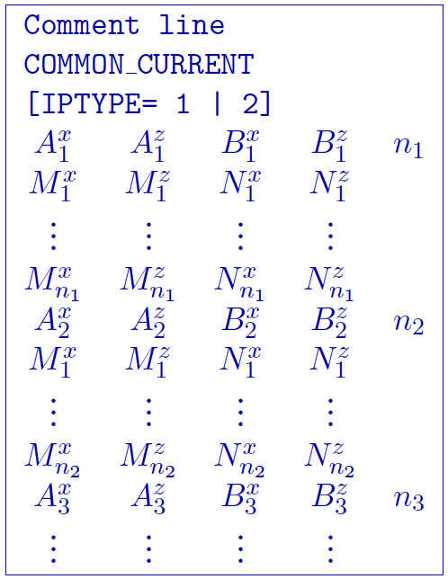
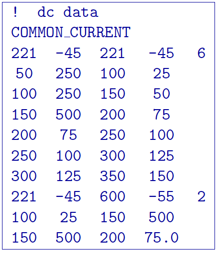
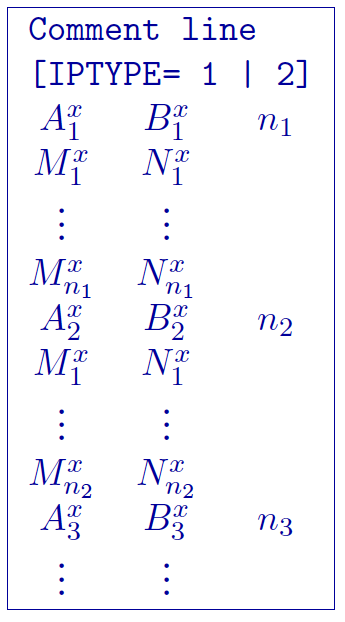
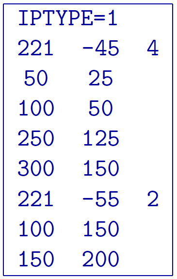
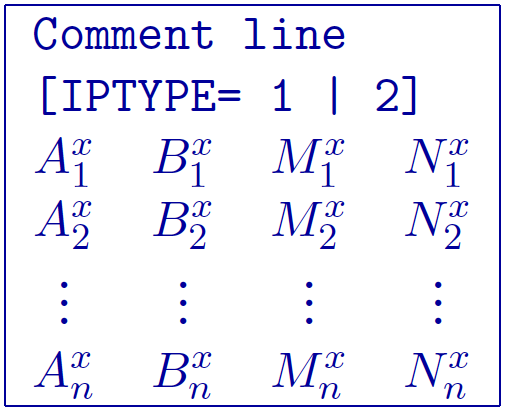
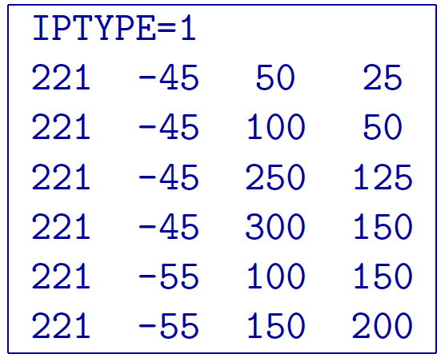

.. _locations:

Electrodes file
===============

This file contains the electrode locations for **DCIPF2D**. The electrodes file
follows the same formats at the *Observations* files, but without data and standard
deviations. Thus, an electrode file can have three different formats:
the *general*, *surface*, or *simple* format. Only a single format is allowed in a data file. **The
general format is the only format that will allow the use of borehole
locations**. The type of format chosen for forward modelling does not
make any difference to the *DCIPF2D* and is determined only by the user’s
preference. At the beginning of execution, the programs will determine
the format and the output files will be written in the same format.

General format
--------------

The forward modelling code **DCIPF2D** can handle arbitrary electrode
configurations, and a mixture of different configurations can be present
in the data file. This is accomplished by specifying the locations of
four electrodes for each location. Whenever the two current electrodes,
or two potential electrodes, are given the identical location, that
particular pair is considered to be a single pole with the negative
electrode being at infinity. The format consists of a line with the
current electrode location and number of potential electrode locations
associated with it. Each location has :math:`x` and :math:`z`
coordinates. An example of the format file structure is as follows:



#. :math:`\text{COMMON_CURRENT}`: This flag is given prior to to let the code know that it is a general
   format file

#. :math:`Comment~line`: Any comments can go here. This line is ignored by and must have a
   preceding “!”

#. :math:`\text{'number of sources'}`: integer number giving the totla number of sources in the file.

#. :math:`IPTYPE`: Only used for IP inversion and not required if only using DC
   inversion. NOTE: If omitted from IP inversion, the program will
   choose :math:`IPTYPE=1`.

     - :math:`IPTYPE=1`, Type of IP data is apparent chargeability
     - :math:`IPTYPE=2`, Type of IP data is secondary potentials

#. :math:`A^x_i`: i\ :math:`^{th}` horizontal position along line of current electrode A

#. :math:`A^z_i`: i\ :math:`^{th}` elevation of current electrode A

#. :math:`B^x_i`: i\ :math:`^{th}` horizontal position along line of current electrode B

#. :math:`B^z_i`: i\ :math:`^{th}` elevation of current electrode B

#. :math:`M^x_j`: j\ :math:`^{th}` horizontal position along line of potential
   electrode M associated with the i\ :math:`^{th}` current pair

#. :math:`M^z_j`: j\ :math:`^{th}` elevation of potential electrode M associated with
   the i\ :math:`^{th}` current pair

#. :math:`N^x_j`: j\ :math:`^{th}` horizontal position along line of potential
   electrode N associated with the i\ :math:`^{th}` current pair

#. :math:`N^z_j`: j\ :math:`^{th}` elevation of potential electrode N associated with
   the i\ :math:`^{th}` current pair

Example of general format
`````````````````````````

The following is an example of locations for DC data (e.g., no IPTYPE):



In the above example, there are two current electrode locations, the
first with six potential electrodes and the second with two potential
electrode data. The line “IPTYPE=2” would be added if this file were IP
data of second potentials.

Surface format
--------------

The surface format is similar to the general format with difference that
the elevation data is not given. Instead, the program places the
electrodes on top of the discretized topographic surface. Accordingly,
this format **cannot be used with borehole data** and if no topography
is given, assumes the data are on top of the mesh at an elevation of 0.
Whenever the two current electrodes, or two potential electrodes, are
given the identical location, that particular pair is considered to be a
single pole with the negative electrode being at infinity. The format
consists of a line with the current electrode location and number of
potential electrode locations associated with it. An example of the
format file structure is as follows:



The following are detailed summaries of components of the surface-format
observations file:

#. :math:`Comment~line`: Any comments can go here. This line is ignored by *dcipf2d* and must have a
   preceding “!”

#. :math:`\text{'number of sources'}`: integer number giving the totla number of sources in the file.

#. :math:`IPTYPE`: Only used for IP inversion and not required if only using DC
   inversion. NOTE: If omitted from IP inversion, the program will
   choose :math:`IPTYPE=1`.

     - :math:`IPTYPE=1`, Type of IP data is apparent chargeability
     - :math:`IPTYPE=2`, Type of IP data is secondary potentials

#. :math:`A^x_i`: i\ :math:`^{th}` horizontal position along line of current electrode A

#. :math:`B^x_i`: i\ :math:`^{th}` horizontal position along line of current electrode B

#. :math:`M^x_j`: j\ :math:`^{th}` horizontal position along line of potential
   electrode M associated with the i\ :math:`^{th}` current pair

#. :math:`N^x_j`: j\ :math:`^{th}` horizontal position along line of potential
   electrode N associated with the i\ :math:`^{th}` current pair

Example of surface format
`````````````````````````

The following is an example of IP data in units of apparent
chargeability:



In the above example, there are two current electrode locations, the
first with four potential electrodes and the second with two potential
electrode data. The line “IPTYPE=1” would be absent if this file were DC
data.

Simple format
-------------

The simple format is the most straightforward, but also most restrictive
of the three formats. The elevations are not given similar to the
surface format with difference that the elevation data is not given.
Instead, the program places the electrodes on top of the discretized
topographic surface. Accordingly, this format **cannot be used with
borehole data** and if no topography is given, assumes the locations are
on top of the mesh at an elevation of 0. Whenever the two current
electrodes, or two potential electrodes, are given the identical
location, that particular pair is considered to be a single pole with
the negative electrode being at infinity. The format consists of a line
with the current electrode pair location and potential electrode
location pair. An example of the format file structure is as follows:



The following are detailed summaries of components of the simple-format
observations file:

#. :math:`Comment~line`: Any comments can go here. This line is ignored by *dcipf2d* and must have a
   preceding “!”

#. :math:`IPTYPE`: Only used for IP inversion and not required if only using DC
   inversion. NOTE: If omitted from IP inversion, the program will
   choose :math:`IPTYPE=1`.

     - :math:`IPTYPE=1`, Type of IP data is apparent chargeability
     - :math:`IPTYPE=2`, Type of IP data is secondary potentials

#. :math:`A^x_i`: i\ :math:`^{th}` horizontal position along line of current electrode A

#. :math:`B^x_i`: i\ :math:`^{th}` horizontal position along line of current electrode B

#. :math:`M^x_j`: j\ :math:`^{th}` horizontal position along line of potential
   electrode M associated with the i\ :math:`^{th}` current pair

#. :math:`N^x_j`: j\ :math:`^{th}` horizontal position along line of potential
   electrode N associated with the i\ :math:`^{th}` current pair

Example of simple format
````````````````````````

The following is an example of the simple format. The data are the same
as given in the surface format example; IP data in units of apparent
chargeability:

