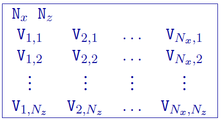
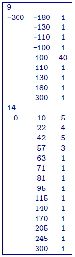

.. _model2d:

Model file
==========

This is the file used to define any model given to **DCIP2D**. Each file contains
the cell values within the model. The number of cells in the :math:`x-`
and :math:`z-`\ directions are specified in this file and should
coorespond to the values given in the file.

An example of the file structure is as follows:

#. :math:`N_x`: Number of cells in the horizontal direction

#. :math:`N_z`: Number of cells in the vertical direction.

#. :math:`V_{i,k}`: Value of the model at the i\ :math:`^{th}` cell in the horizontal
   direction and j\ :math:`^{th}` cell in depth. When :math:`j=1`, the
   cell is at the top of the mesh and :math:`j=N_z` corresponds to the
   bottom of the mesh. In the horizontal direction :math:`i=1`
   corresponds to the beginning of the line (e.g., West) and
   :math:`i=N_x` is at the end of the line (e.g., East).

#. :math:`X_i`: i\ :math:`^{th}` horizontal location

#. :math:`elev_i`: i\ :math:`^{th}` elevation

Example of a model
------------------

The following is an example of a model:

In the above example, there are 10 horizontal cells and 3 vertical cell
associated with the mesh. The first row is broken into the first three
lines of the file. The second row of the model is given on lines 2-4.
The third row of the model is given on lines 5 and 6. **DCIP2D** would also read
the same model with three rows of ten values.

Notes on the 2D model
---------------------

The model is stored in a row format with V\ :math:`_{1,1}` being the top
left cell. As shown above, each row of the model, V\ :math:`_{1,k}`
:math:` \hdots\ ` V\ :math:`_{N_x,k}`, can be broken down into more than
a single line in the file, however, each model row must start on a new
line.

In the presence of topography, the cells above the surface specified by
topo.dat represent the air and, therefore, are not part of the model.
For simplicity, however, the files model.con and model.chg must include
those cells as defined by the *Mesh* file. These cells in the model file will
be ignored when the model is input to a program. To distinguish these
cells, the user can assign a special value to them, for instance, a very
small value (say 10\ :math:`^{-10}`) for conductivity and a negative
value for the chargeability model. These cells in the output model files
from the inversion programs have a conductivity value equal to
10\ :math:`^{-8}` times the mean conductivity value immediately beneath
the surface and a chargeability value of -10:math:`^{30}`.

Active model file
=================

The active cell model file is a specific type of model that has the same
format, but only contains values of -1, 0, or 1. Default (*null* option)
active cells models place all cells in the model as active, meaning they
can be changed during the inversion and influence the model objective
function and data misfit. Cells that are inactive (not allowed to
change) and *do not* influence the model objective function should be
set to 0. Cells that are inactive, but can influence the values of
neighbouring cells through the model objective function should have a
value of -1.
