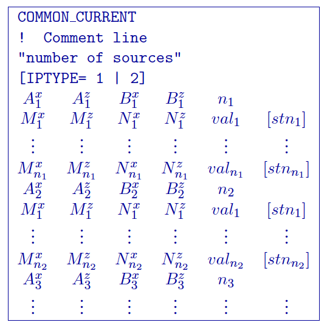
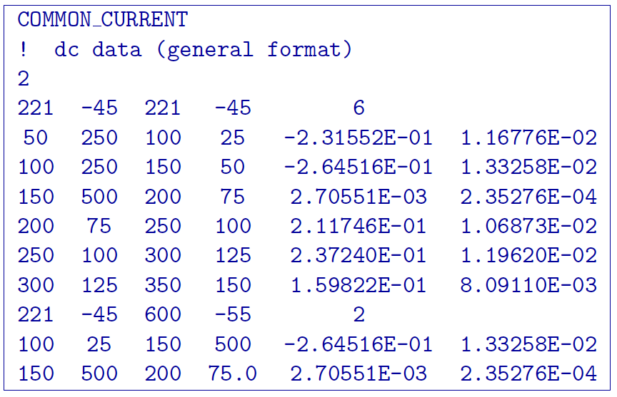
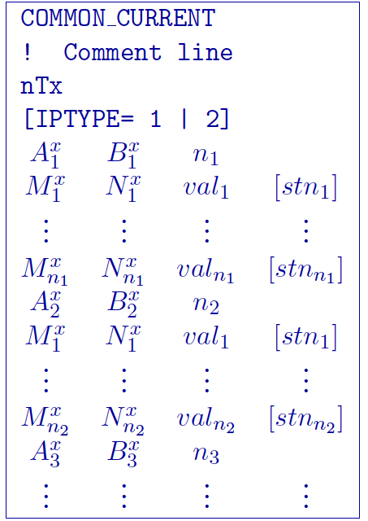
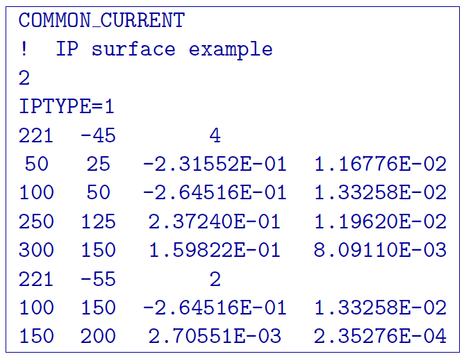
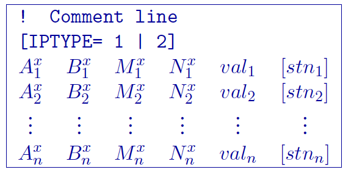
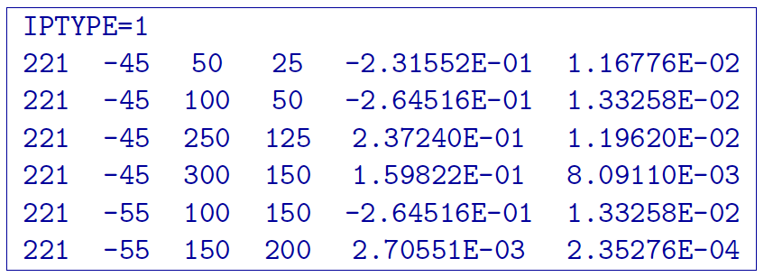

.. _observations:

Observations file
=================

This file contains the observed measurements and the associated
electrode locations. Both potential data and apparent chargeability data
are stored in the same format. This will be the format of all the data
files that are output from , and are input to and .

It is assumed that the survey is carried out either along a line in the
:math:`x-`\ direction perpendicular to geologic strike or along a
borehole. In the presence of topography, it is assumed that all current
and potential electrodes are located along the line and are placed on
the topography at each :math:`x` location. In other words, the programs
in the  package will automatically place the electrodes on the surface
according to the topography and the :math:`x` location given in the
observations file. Electrodes will be at :math:`z=0` if topography is
not given (e.g., set to null). The :math:`z` coordinates should be
provided in the observations file when the data are located down a
borehole. Any surface/borehole combination of electrodes is allowed in.
The observations file can have three different formats: the , , or
format. Only a single format is allowed in a data file. **The general
format is the only format that will allow the use of borehole
locations**. The type of format chosen to store the data does not make
any difference to the  program library and is determined only by the
user’s preference. At the beginning of execution, the programs will
determine the format and the output files will be written in the same
format. Standard deviations are optional in each format. The calculation
of the standard deviation within is given below in the detailed
summaries of components. All standard deviations must either be given or
not given to be calculated.

Calculation of default standard deviations
------------------------------------------

The default standard deviation is calculated from the DC data using the
following rules: stn\ :math:`_i = 0.05 \times |\phi_i| + \phi_{max}`,
where :math:`\phi_{max}` is the potential at the maximum electrode
separation averaged over five (5) adjacent stations. The default
standard deviation is calculated for IP data by:
stn\ :math:`_i = 0.05 \times |\eta_i| + \eta_{min}`, where
:math:`\eta_{min}` is calculated standard deviation of all apparent
chargeabilities in the data set. We stress that the default errors are
only an initial guess and they facilitate a preliminary inversion of the
data. The user will want to alter these error estimates for the final
inversion used for interpretation. The data with the default errors are
written in using the given format. They can be copied to a file for
finer adjustment of the error estimates or the user can supply his or
her own errors directly.

General format
--------------

The  library can handle arbitrary electrode configurations, and a
mixture of different configurations can be present in the data file.
This is accomplished by specifying the locations of four electrodes for
each datum. Whenever the two current electrodes, or two potential
electrodes, are given the identical location, that particular pair is
considered to be a single pole with the negative electrode being at
infinity. The format consists of a line with the current electrode
location and number of potential electrode locations associated with it.
Each location has :math:`x` and :math:`z` coordinates. An example of the
format file structure is as follows:



#. :math:`\text{COMMON_CURRENT}`: This flag is given prior to to let the code know that it is a general
   format file

#. :math:`Comment~line`: Any comments can go here. This line is ignored by and must have a
   preceding “!”

#. :math:`\text{'number of sources'}`: integer number giving the totla number of sources in the file.

#. :math:`IPTYPE`: Only used for IP inversion and not required if only using DC
   inversion. NOTE: If omitted from IP inversion, the program will
   choose :math:`IPTYPE=1`.
     | :math:`IPTYPE=1`, Type of IP data is apparent chargeability
     | :math:`IPTYPE=2`, Type of IP data is secondary potentials

#. :math:`A^x_i`: i\ :math:`^{th}` horizontal position along line of current electrode A

#. :math:`A^z_i`: i\ :math:`^{th}` elevation of current electrode A

#. :math:`B^x_i`: i\ :math:`^{th}` horizontal position along line of current electrode B

#. :math:`B^z_i`: i\ :math:`^{th}` elevation of current electrode B

#. :math:`M^x_j`: j\ :math:`^{th}` horizontal position along line of potential
   electrode M associated with the i\ :math:`^{th}` current pair

#. :math:`M^z_j`: j\ :math:`^{th}` elevation of potential electrode M associated with
   the i\ :math:`^{th}` current pair

#. :math:`N^x_j`: j\ :math:`^{th}` horizontal position along line of potential
   electrode N associated with the i\ :math:`^{th}` current pair

#. :math:`N^z_j`: j\ :math:`^{th}` elevation of potential electrode N associated with
   the i\ :math:`^{th}` current pair

#. :math:`val_j`: j\ :math:`^{th}` observed datum related to the j\ :math:`^{th}`
   potential pair and i\ :math:`^{th}` current pair. The potential
   measurements must be measured value in Volts, or a dimensionless real
   number (not percentage) for apparent chargeability (*potential is
   always normalized to unit current amplitude*). There are four types
   of IP data generally in use; two gathered in the time domain and two
   gathered in the frequency domain. For small chargeabilities, as is
   nearly always the case for earth materials, all data types can be
   used as input for inversion, and resulting models will have
   chargeabilities in the same units.

#. :math:`stn_j`: Optional j\ :math:`^{th}` standard deviation associated with the
   j\ :math:`^{th}` datum. This is a positive, absolute value (not a
   percentage). If the first datum does not have an error field (or the
   error field is commented out by placing a “!” before it), the default
   errors for the entire data set will be calculated from the data.

Example of general format
`````````````````````````

The following is an example of DC data (e.g., no IPTYPE):



In the above example, there are two current electrode locations, the
first with six potential electrodes and the second with two potential
electrode data. The line “IPTYPE=2” would be added if this file were IP
data of second potentials.

Surface format
--------------

The surface format is similar to the general format with difference that
the elevation data is not given. Instead, the program places the
electrodes on top of the discretized topographic surface. Accordingly,
this format **cannot be used with borehole data** and if no topography
is given, assumes the data are on top of the mesh at an elevation of 0.
Whenever the two current electrodes, or two potential electrodes, are
given the identical location, that particular pair is considered to be a
single pole with the negative electrode being at infinity. The format
consists of a line with the current electrode location and number of
potential electrode locations associated with it. An example of the
format file structure is as follows:



The following are detailed summaries of components of the surface-format
observations file:

#. :math:`\text{COMMON_CURRENT}`: This flag is given prior to to let the code know that it is a general
   format file

#. :math:`Comment~line`: Any comments can go here. This line is ignored by and must have a
   preceding “!”

#. :math:`\text{'number of sources'}`: integer number giving the totla number of sources in the file.

#. :math:`IPTYPE`: Only used for IP inversion and not required if only using DC
   inversion. NOTE: If omitted from IP inversion, the program will
   choose :math:`IPTYPE=1`.
     | :math:`IPTYPE=1`, Type of IP data is apparent chargeability
     | :math:`IPTYPE=2`, Type of IP data is secondary potentials

#. :math:`A^x_i`: i\ :math:`^{th}` horizontal position along line of current electrode A

#. :math:`B^x_i`: i\ :math:`^{th}` horizontal position along line of current electrode B

#. :math:`M^x_j`: j\ :math:`^{th}` horizontal position along line of potential
   electrode M associated with the i\ :math:`^{th}` current pair

#. :math:`N^x_j`: j\ :math:`^{th}` horizontal position along line of potential
   electrode N associated with the i\ :math:`^{th}` current pair

#. :math:`val_j`: j\ :math:`^{th}` observed datum related to the j\ :math:`^{th}`
   potential pair and i\ :math:`^{th}` current pair. The potential
   measurements must be measured value in Volts, or a dimensionless real
   number (not percentage) for apparent chargeability (*potential is
   always normalized to unit current amplitude*). There are four types
   of IP data generally in use; two gathered in the time domain and two
   gathered in the frequency domain. For small chargeabilities, as is
   nearly always the case for earth materials, all data types can be
   used as input for inversion, and resulting models will have
   chargeabilities in the same units.

#. :math:`stn_j`: Optional j\ :math:`^{th}` standard deviation associated with the
   j\ :math:`^{th}` datum. This is a positive, absolute value (not a
   percentage). If the first datum does not have an error field (or the
   error field is commented out by placing a “!” before it), the default
   errors for the entire data set will be calculated from the data.

Example of surface format
`````````````````````````

The following is an example of IP data in units of apparent
chargeability:



In the above example, there are two current electrode locations, the
first with four potential electrodes and the second with two potential
electrode data. The line “IPTYPE=1” would be absent if this file were DC
data.

Simple format
-------------

The simple format is the most straightforward, but also most restrictive
of the three formats. The elevations are not given similar to the
surface format with difference that the elevation data is not given.
Instead, the program places the electrodes on top of the discretized
topographic surface. Accordingly, this format **cannot be used with
borehole data** and if no topography is given, assumes the data are on
top of the mesh at an elevation of 0. Whenever the two current
electrodes, or two potential electrodes, are given the identical
location, that particular pair is considered to be a single pole with
the negative electrode being at infinity. The format consists of a line
with the current electrode pair location and potential electrode
location pair. An example of the format file structure is as follows:



The following are detailed summaries of components of the simple-format
observations file:

#. :math:`Comment~line`: Any comments can go here. This line is ignored by and must have a
   preceding “!”

#. :math:`IPTYPE`: Only used for IP inversion and not required if only using DC
   inversion. NOTE: If omitted from IP inversion, the program will
   choose :math:`IPTYPE=1`.
     | :math:`IPTYPE=1`, Type of IP data is apparent chargeability
     | :math:`IPTYPE=2`, Type of IP data is secondary potentials

#. :math:`A^x_i`: i\ :math:`^{th}` horizontal position along line of current electrode A

#. :math:`B^x_i`: i\ :math:`^{th}` horizontal position along line of current electrode B

#. :math:`M^x_j`: j\ :math:`^{th}` horizontal position along line of potential
   electrode M associated with the i\ :math:`^{th}` current pair

#. :math:`N^x_j`: j\ :math:`^{th}` horizontal position along line of potential
   electrode N associated with the i\ :math:`^{th}` current pair

Example of simple format
````````````````````````

The following is an example of the simple format. The data are the same
as given in the surface format example; IP data in units of apparent
chargeability:


