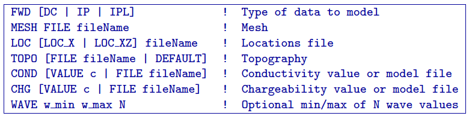
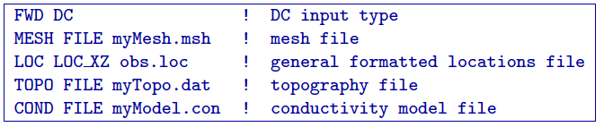
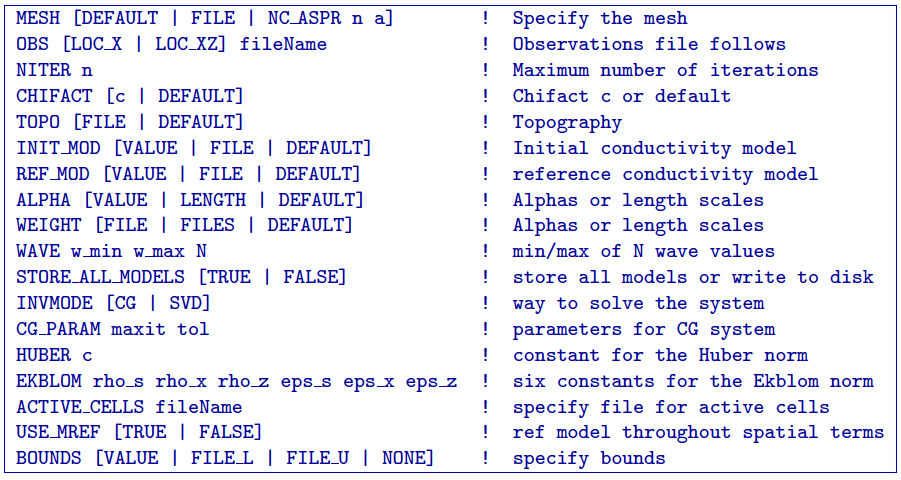
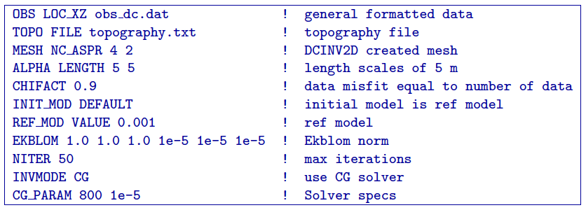
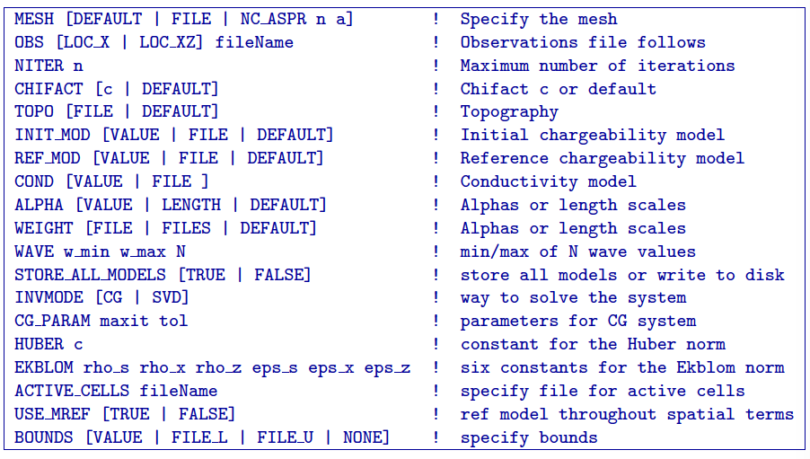
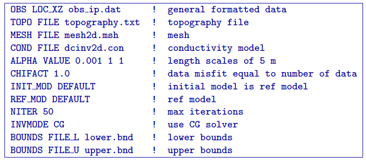

.. _runningtheprograms:

Running the programs
====================

The software package  uses five general codes:

- **DCIPF2D**: performs 2D forward modelling for DC and IP data

- **DCINV2D**: inverts DC potentials to recover a 2D conductivity model

- **IPINV2D**: inverts IP data to recover a 2D chargeability model

This section discusses the use of these codes individually.

Introduction
------------

All programs in the package can be executed under Windows or Linux
environments. They can be run by typing the program name followed by a
control file in the “command prompt” (Windows) or “terminal” (Linux).
They can be executed directly on the command line or in a shell script
or batch file. When a program is executed without any arguments, it will
print the usage to screen.

Execution on a single computer
~~~~~~~~~~~~~~~~~~~~~~~~~~~~~~

The command format and the control, or input, file format on a single
machine are described below. Within the command prompt or terminal, any
of the programs can be called using:

*program* :math:`arg_1` [:math:`arg_2` :math:`\cdots` :math:`arg_i`]

where:

-  *program* is the name of the executable

-  :math:`arg_i` is a command line argument, which can be a name of corresponding
   required or optional file. Optional command line arguments are
   specified by brackets: . **NOTE:** Typing *-inp* as the control file, serves
   as a help function and returns all of the keyword combinations
   allowed for that program.

Each control file contains a formatted list of arguments, parameters,
and file names in a combination specific for the executable, which can
be in any order. Values that are being set by the user are given to each
program through a specific list of keywords (e.g. *WEIGHT*, to specify the type
of weighting). Different control file formats will be explained further
in the document for each executable. All files are in ASCII text format
- they can be read with any text editor. Input and control files can
have any name the user specifies. Details for the format of each file
can be found in Section :ref:`Elements <elements>`. When inputting a file, the word 
FILE should be following the keyword (e.g., *MESH FILE mesh.msh*). If a value is being used than
the word VALUE will follow a keyword (e.g., *COND VALUE 0.001*).

DCIPF2D
-------

This program performs forward modelling of DC and IP data. Command line
usage:

*dcipf2d dcipf2d.inp*

where the input file, *dcipf2d.inp*, is described below. The options can be in any
order.

Input files
~~~~~~~~~~~

Keywords for the input file dcipf2d.inp are:

-  *FWD*: The choices after this keyword are:

   #. *DC* for DC forward modelling. The chargeability model and wave, if
      given, is ignored for DC forward modelling only.

   #. *IP* for IP forward modelling.

   #. *IPL* for IP forward modelling using product of the sensitivity matrix
      and chargeability.

-  *MESH FILE* The 2D mesh file name is followed after these keywords. For example MESH FILE mesh.msh.

-  *LOC* The observation locations. The choices after this keyword are:

   #. *LOC_X* when giving *simple* or *surface* locations formats.

   #. *LOC_XZ* when using the *general* locations format.

-  *TOPO* The choices for the topography are:

   #. *FILE* followed by the name of the topography file.

   #. *DEFAULT* for flat topography at and elevation of 0.

-  *COND* The choices for the conductivity model are:

   #. *FILE* followed by the name of the conductivity file .

   #. *VALUE* followed by a number for the conductivity throughout the mesh.

-  *CHG* The choices for the chargeability model are:

   #. *FILE* followed by the name of the chargeability file .

   #. *VALUE* followed by a number for the chargeability throughout the mesh.

-  *WAVE* is followed by 3 constants: *w_min*, *w_max* and *N*. These are the wave numbers used in the
   cosine transform. There will be wave values, log spaced from to in
   time. The default values (if *WAVE* is not given) is *w_min = 2.5e-4, w max = 1.0*, and *N= 13*.

Example of dcipf2d.inp
~~~~~~~~~~~~~~~~~~~~~~

Example of an input file for DCIPF2D to model DC data that are given in general format
and a with a topography file:

Output files
~~~~~~~~~~~~

The files created by DCIPF2D are:

-  *obc_dc.dat* The computed DC potential data.

-  *obc_ip.dat* The computed IP data if the option *IP* is chosen.

-  *obc_ipL.dat* The computed IP data if the option *IPL* is chosen.

DCINV2D
-------

This program performs the inversion of DC resistivity data. Command line
usage:

*dcinv2d dcinv2d.inp*

where the input file, dcinv2d.inp, is described below. The options can be in any
order. The minimum keywords needed for an inversion are *MESH* and *OBS*.

Input Files
~~~~~~~~~~~

Keywords for the input file dcinv2d.inp are:

-  *MESH* The choices after this keyword are:

   #. *DEFAULT* the programs creates a mesh (output dcinv2d.msh) with 3 cells between
      electrodes and the aspect ratio of the top cells set to 3.
      **NOTE**: This option assumes that the data are collected by
      commonly used arrays and that the topographic relief is moderate.
      Thus, this option may not be optimal when the data are collected
      with unusual electrode geometry or when data are collected over
      severe surface topography. In such cases, the user should redesign
      the mesh so that it is better suited for the particular needs of
      the data set.

   #. *FILE* file name of the mesh

   #. *NC_ASPR n a* creates a mesh (output dcinv2d.msh) that has *n* cells between the electrodes and
      the aspect ratio of the top cells is set to *a*.

-  *OBS* The observation locations. The choices after this keyword are:

   #. *LOC_X* when giving simple or surface locations formats

   #. *LOC_XZ* when using the general locations format.

-  *NITER* A value follows this keyword representing the number of maximum
   iterations for the inversion. **NOTE**: The program will terminate
   before the specified maximum number of iterations is reached if the
   expected data misfit is achieved and if the model norm has plateaued.
   However, if the program exits when the maximum iteration is reached,
   the file dcinv2d.out should be checked to see if the desired (based on the number
   of data and chi factor) has been reached and if the model norm is no
   longer changing. If either of these conditions has not been met then
   the program should be restarted. If the desired misfit level is not
   achieved, but the model norm has plateaued and the model is not
   changing between successive iterations, then the user may want to
   adjust the target misfit to a higher value. Also an investigation as
   to which data are most poorly fit can be informative. It may be that
   the assigned standard deviations to specific data are unrealistically
   small. The program restarts using the information in dcinv2d.out and dcinv2d.con.

-  *CHIFACT* The value at which the program reproduced the data. The choices after
   this keyword are:

   #. *DEFAULT* where the program will start with 1e-3 initially and then when the
      misfit stop decreasing, the chi factor will be changed by 10%

   #. *constant* the value to set the chi factor (1 is when the data misfit equals
      the number of data), or if a value is not there, but *CHIFACT* is given, the
      program will stop when the data misfit reaches the number of data

-  *TOPO* The choices after this keyword are:

   #. *FILE* followed by the name of the topography file

   #. *DEFAULT* for flat topography at an elevation of 0.

-  *INIT_MOD* The choices for the initial model are:

   #. *FILE filename* name of the initial conductivity file

   #. *VALUE constant* the value for the initial conductivity throughout the mesh

   #. *DEFAULT* for the initial model to be set to the reference model.

-  *REF_MOD* The choices for the reference model are:

   #. *FILE filename* name of the reference conductivity file

   #. *VALUE constant* the value for the reference conductivity throughout the mesh

   #. *DEFAULT* the reference model is equal to the best fitting half-space model.

-  *WAVE* is followed by 3 constants: *w_min*, *w_max* and *N*. These are the wave numbers used in the
   cosine transform. There will be wave values, log spaced from to in
   time. The default values (if *WAVE* is not given) is *w_min = 2.5e-4, w max = 1.0*, and *N= 13*.

-  *ALPHA* The choices after this keyword are:

   #. *DEFAULT* where the program will set :math:`\alpha_s` =
      0.001\*(90\ :math:`/`\ max electrode separation)\ :math:`^2` and
      :math:`\alpha_x = \alpha_z = 1`.

   #. *VALUE a_s a_y a_z* the user gives the coefficients for the each model component for
      the model objective function from equation :eq:`intMOF`:
      :math:`\alpha_s` is the smallest model component, :math:`\alpha_x`
      is along line smoothness, and :math:`\alpha_z` is vertical
      smoothness.

   #. *LENGTH L_x L_z* the user gives the length scales and the smallest model component
      is calculated accordingly. The conversion from :math:`\alpha`\ ’s
      to length scales can be done by:

      .. math:: L_x = \sqrt{\frac{\alpha_x}{\alpha_s}} ; ~L_z = \sqrt{\frac{\alpha_z}{\alpha_s}}

      where length scales are defined in meters. When user-defined, it
      is preferable to have length scales exceed the corresponding cell
      dimensions.

-  *WEIGHT* The weighting for the model objective function allows for three
   options:

   #. *DEFAULT* No weighting is supplied (all values of weights are 1)

   #. *FILE filename* The weighting is supplied as a file with all the weights in one
      file

   #. *FILES fileS fileX fileZ* The weighting is supplied as three separate weight files with
      the weight for the smallest model component in fileS, the x-component written in file
      fileX and the z-component written in fileZ.

-  *STORE ALL MODELS* There are two choices:

   #. *TRUE* Write all models and predicted data to disk. Each iteration will have dcinv2d_xx.con
      and dcinv2d_xx.pre files where xx is the iteration (e.g., 01 for the first iteration)

   #. *FALSE* Only the final model and predicted data file are written. These
      files are named dcinv2d.con and dcinv2d.pre for the conductivity and predicted data,
      respectively.

-  INVMODE This specifies the way the system is solved:

   #. *SVD* Solve the system using a subspace method with basis vectors. This
      is the solution methodology of the original code and the default
      if not given.

   #. *CG* Solve the system using a subspace method with conjugate gradients
      (CG). This allows additional constraints (i.e., Huber and Ekblom
      norms) to be incorporated into the code.

-  *CG_PARAMS* is used when the inversion mode is . The keyword is followed by two
   constants: *maxit* specifying the maximum number of iterations (default is
   10), and *tol* specifying the solution’s accuracy (default is 0.01)

-  *HUBER* The Huber norm is used when evaluating the data misfit. A constant
   follows this keyword and this option is only available when using the
   CG inversion mode option. The default value is 1e100. The constant *c* is
   from equation :eq:`Huber\_phid`.

-  *EKBLOM* Use the Ekblom norm. Six (6) values should follow this keyword:
   :math:`\rho_s; \rho_x; \rho_z; \varepsilon_s; \varepsilon_x; \varepsilon_z` representing the constants found in equation :eq:ekblom`.

-  *ACTIVE_CELLS* followed by the file name of the active cell file.

-  *USE_MREF* This option is used to decide if the reference model should be in the
   spatial terms of the model objective function (equation :eq:`intMOF`).
   There are two options: *TRUE* to include the reference model in the spatial
   terms or *FALSE* to have the reference model only in the smallest model
   component.

-  *BOUNDS* The bounds options are:

   #. *NONE* Do not include bounds in the inversion

   #. *VALUE lwr upr* Give a constant global lower bound of *lwr* and upper bound of *upr*.

   #. *FILE_L fileName* The lower bound is given in a file and is in the *model* format.

   #. *FILE_U fileName* The upper bound is given in a file and is in the *model* format.

Example of dcinv2d.inp
~~~~~~~~~~~~~~~~~~~~~~

Below is an example of the input file *dcinv2d.inp*. The code will create a mesh with
4 cell between electrode locations and the aspect ratio of the size top
cells set to 2. This means the reference and initial models will not be
given in a file, but rather set to 0.001 S/m. The length scales will be
5 m in each direction and the Ekblom norm will have exponents of 1.0 in
each direction to emphasize blockiness. It will start from scratch and
stop after 50 iterations if the desired misfit (equal to 90% of the
number of data) is not achieved. Conjugate gradients are used to solve
the system of equations with a maximum number of CG iterations set at
800 and a relative accuracy of 1e-5. There are no bounds in this
inversion.

Output Files
~~~~~~~~~~~~

*DCINV2D* will create the following files:

#. *dcinv2d.log* The log file containing the minimum information for each iteration,
   summary of the inversion, and standard deviations if assigned by DCINV2D.

#. *dcinv2d.out* The developers log file containing the values of the model objective
   function value(\ :math:`\psi_m`), trade-off parameter
   (:math:`\beta`), and data misfit (:math:`\psi_d`) at each iteration

#. *dcinv2d_iter.con* Conductivity model for each iteration (*iter* defines the iteration step)
   if is used

#. *dcinv2d_iter.pre* Predicted data for each iteration (*iter* defines the iteration step) if is
   used

#. *dcinv2d.pre* Predicted data file that is updated after each iteration (will also
   be the final predicted data)

#. *dcinv2d.con* Conductivity model that matches the predicted data file and is
   updated after each iteration (will also be the final ecovered model)

#. *sensitivity.txt* Model file of average sensitivity values for the mesh

IPINV2D
-------

This program performs the 2D inversion of induced polarization data.
Command line usage:

*ipinv2d ipinv2d.inp*

for the control ipinv2d.inp described below. The options can be in any order. The minimum
keywords needed for an inversion are MESH, OBS, and COND.

Input Files
~~~~~~~~~~~

Keywords for the input file ipinv2d.inp are:

-  *MESH* The choices after this keyword are:

   #. *DEFAULT* the programs creates a mesh (output dcinv2d.msh) with 3 cells between
      electrodes and the aspect ratio of the top cells set to 3.
      **NOTE**: This option assumes that the data are collected by
      commonly used arrays and that the topographic relief is moderate.
      Thus, this option may not be optimal when the data are collected
      with unusual electrode geometry or when data are collected over
      severe surface topography. In such cases, the user should redesign
      the mesh so that it is better suited for the particular needs of
      the data set.

   #. *FILE* file name of the mesh

   #. *NC_ASPR n a* creates a mesh (output dcinv2d.msh) that has *n* cells between the electrodes and
      the aspect ratio of the top cells is set to *a*.

-  *OBS* The observation locations. The choices after this keyword are:

   #. *LOC_X* when giving simple or surface locations formats

   #. *LOC_XZ* when using the general locations format.

-  *NITER* A value follows this keyword representing the number of maximum
   iterations for the inversion. **NOTE**: The program will terminate
   before the specified maximum number of iterations is reached if the
   expected data misfit is achieved and if the model norm has plateaued.
   However, if the program exits when the maximum iteration is reached,
   the file ipinv2d.out should be checked to see if the desired (based on the number
   of data and chi factor) has been reached and if the model norm is no
   longer changing. If either of these conditions has not been met then
   the program should be restarted. If the desired misfit level is not
   achieved, but the model norm has plateaued and the model is not
   changing between successive iterations, then the user may want to
   adjust the target misfit to a higher value. Also an investigation as
   to which data are most poorly fit can be informative. It may be that
   the assigned standard deviations to specific data are unrealistically
   small. The program restarts using the information in ipinv2d.out and ipinv2d.con.

-  *CHIFACT* The value at which the program reproduced the data. The choices after
   this keyword are:

   #. *DEFAULT* where the program will start with 1e-3 initially and then when the
      misfit stop decreasing, the chi factor will be changed by 10%

   #. *constant* the value to set the chi factor (1 is when the data misfit equals
      the number of data), or if a value is not there, but *CHIFACT* is given, the
      program will stop when the data misfit reaches the number of data

-  *TOPO* The choices after this keyword are:

   #. *FILE* followed by the name of the topography file

   #. *DEFAULT* for flat topography at an elevation of 0.

-  *INIT_MOD* The choices for the initial model are:

   #. *FILE filename* name of the initial chargeability file

   #. *VALUE constant* the value for the initial chargeability throughout the mesh

   #. *DEFAULT* for the initial model to be set to the reference model.

-  *REF_MOD* The choices for the reference model are:

   #. *FILE filename* name of the reference chargeability file

   #. *VALUE constant* the value for the reference chargeability throughout the mesh

   #. *DEFAULT* the reference model is equal to 0.

-  *COND* The choices for the conductivity model (required) are:

   #. *FILE filename* name of the conductivity file

   #. *VALUE constant* the value for the conductivity throughout the mesh. **NOTE**: The
      conductivity of a uniform half space for IP inversions should only
      be used for preliminary examination of the data. When there is
      little structure in the background conductivity, the inversion
      using this default mode can yield a reasonable chargeability model
      and it is justifiable to fit the data close to the expected misfit
      value. However, when the background conductivity deviates greatly
      from a uniform half space, reproducing the data to within the
      assumed errors will certainly result in over-fitting the data. If
      the half-space conductivity is assumed, then it is prudent to
      assign a value greater than 1.0 for chi factor when the background
      conductivity is structurally complex. The judgment can be made
      based upon the complexity of the apparent resistivity
      pseudo-section.

-  *WAVE* is followed by 3 constants: *w_min*, *w_max* and *N*. These are the wave numbers used in the
   cosine transform. There will be wave values, log spaced from to in
   time. The default values (if *WAVE* is not given) is *w_min = 2.5e-4, w max = 1.0*, and *N= 13*.

-  *ALPHA* The choices after this keyword are:

   #. *DEFAULT* where the program will set :math:`\alpha_s` =
      0.001\*(90\ :math:`/`\ max electrode separation)\ :math:`^2` and
      :math:`\alpha_x = \alpha_z = 1`.

   #. *VALUE a_s a_y a_z* the user gives the coefficients for the each model component for
      the model objective function from equation :eq:`intMOF`:
      :math:`\alpha_s` is the smallest model component, :math:`\alpha_x`
      is along line smoothness, and :math:`\alpha_z` is vertical
      smoothness.

   #. *LENGTH L_x L_z* the user gives the length scales and the smallest model component
      is calculated accordingly. The conversion from :math:`\alpha`\ ’s
      to length scales can be done by:

      .. math:: L_x = \sqrt{\frac{\alpha_x}{\alpha_s}} ; ~L_z = \sqrt{\frac{\alpha_z}{\alpha_s}}

      where length scales are defined in meters. When user-defined, it
      is preferable to have length scales exceed the corresponding cell
      dimensions.

-  *WEIGHT* The weighting for the model objective function allows for three
   options:

   #. *DEFAULT* No weighting is supplied (all values of weights are 1)

   #. *FILE filename* The weighting is supplied as a file with all the weights in one
      file

   #. *FILES fileS fileX fileZ* The weighting is supplied as three separate weight files with
      the weight for the smallest model component in fileS, the x-component written in file
      fileX and the z-component written in fileZ.

-  *STORE ALL MODELS* There are two choices:

   #. *TRUE* Write all models and predicted data to disk. Each iteration will have ipinv2d_xx.con
      and ipinv2d_xx.pre files where xx is the iteration (e.g., 01 for the first iteration)

   #. *FALSE* Only the final model and predicted data file are written. These
      files are named ipinv2d.con and ipinv2d.pre for the chargeability and predicted data,
      respectively.

-  INVMODE This specifies the way the system is solved:

   #. *SVD* Solve the system using a subspace method with basis vectors. This
      is the solution methodology of the original code and the default
      if not given.

   #. *CG* Solve the system using a subspace method with conjugate gradients
      (CG). This allows additional constraints (i.e., Huber and Ekblom
      norms) to be incorporated into the code.

-  *CG_PARAMS* is used when the inversion mode is . The keyword is followed by two
   constants: *maxit* specifying the maximum number of iterations (default is
   10), and *tol* specifying the solution’s accuracy (default is 0.01)

-  *HUBER* The Huber norm is used when evaluating the data misfit. A constant
   follows this keyword and this option is only available when using the
   CG inversion mode option. The default value is 1e100. The constant *c* is
   from equation :eq:`Huber\_phid`.

-  *EKBLOM* Use the Ekblom norm. Six (6) values should follow this keyword:
   :math:`\rho_s; \rho_x; \rho_z; \varepsilon_s; \varepsilon_x; \varepsilon_z` representing the constants found in equation :eq:ekblom`.

-  *ACTIVE_CELLS* followed by the file name of the active cell file.

-  *USE_MREF* This option is used to decide if the reference model should be in the
   spatial terms of the model objective function (equation :eq:`intMOF`).
   There are two options: *TRUE* to include the reference model in the spatial
   terms or *FALSE* to have the reference model only in the smallest model
   component.

-  *BOUNDS* The bounds options are:

   #. *NONE* Do not include bounds in the inversion

   #. *VALUE lwr upr* Give a constant global lower bound of *lwr* and upper bound of *upr*.

   #. *FILE_L fileName* The lower bound is given in a file and is in the *model* format.

   #. *FILE_U fileName* The upper bound is given in a file and is in the *model* format.

Example of ipinv2d.inp
~~~~~~~~~~~~~~~~~~~~~~

Below is an example of the input file ipinv2d.inp. The code reads mesh dcinv2d.msh from the
file with topography from topography.txt. The means the reference and initial models
will be set to one another and equal zero. The conductivity model is
given as the output from . The alpha values have been given for
:math:`\alpha_s=0.001` and :math:`\alpha_x = \alpha_z = 1` . The model
objective function will have an :math:`l_2` norm (which would also be the same as *EKBLOM* 2 2 2 epsS epsX epsZ). It will start from scratch and stop after 50 iterations
if the desired misfit (equal to the number of data) is not achieved.
Conjugate gradients are used to solve the system of equations and the
bounds are given in two separate files.

Output Files
~~~~~~~~~~~~

*IPINV2D* will create the following files:

#. *ipinv2d.log* The log file containing the minimum information for each iteration,
   summary of the inversion, and standard deviations if assigned by IPINV2D.

#. *ipinv2d.out* The developers log file containing the values of the model objective
   function value(\ :math:`\psi_m`), trade-off parameter
   (:math:`\beta`), and data misfit (:math:`\psi_d`) at each iteration

#. *ipinv2d_iter.chg* Chargeability model for each iteration (*iter* defines the iteration step)
   if is used

#. *ipinv2d_iter.pre* Predicted data for each iteration (*iter* defines the iteration step) if is
   used

#. *ipinv2d.pre* Predicted data file that is updated after each iteration (will also
   be the final predicted data)

#. *ipinv2d.chg* Chargeability model that matches the predicted data file and is
   updated after each iteration (will also be the final recovered model)

#. *sensitivity.txt* Model file of average sensitivity values for the mesh
