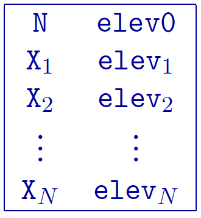
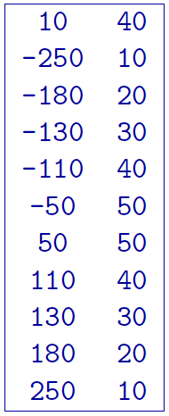

.. _topo2d:

Topography file
===============

This is the file used to define the surface topography along the
traverse of the DC/IP experiment by specifying the elevations of
selected points. It should be noted that the *Mesh* file is linked to the
topography. The specification of the top elevation, *elev0*, sets the top of
the mesh. In other words, :math:`\codeName{elev0}` in the topography is
the top of the mesh and where :math:`z=0`. This point is assumed to be
the highest point on the topographic surface. Locations above *elev0* on the
surface are set to *elev0*. The elevation is positive up similar to the *Observations* file
and thus it can be given in relative values. The topography file must
cover the core portion of the mesh where electrodes are placed. The
coverage should ideally extend to both ends of the mesh, otherwise the
remaining portion towards the ends will be assumed to have the same
surface elevation in each direction as given at the end points within
the file. The topographic surface is discretized onto the mesh using the
elevations at the horizontal nodes that are obtained by linear
interpolation from this file.

An example of the file structure is as follows:

#. :math:`N`: Number of locations defining the topographic profile.

#. :math:`elev0`: The elevation of the top of the 2D *mesh*. See the introductory paragraph
   in this section for details.

#. :math:`X_i`: i\ :math:`^{th}` horizontal location.

#. :math:`elev_i`: i\ :math:`^{th}` elevation at X\ :math:`_i`.

Example of topography
---------------------

The following is an example of topography:

In the above example, there are 10 locations that vary in elevation from
10 to 50 m. The two locations above 40 m (elev0) will be represented as 40 m
of elevation within DCIP2D. The top of the mesh will also be placed at 40 m.
